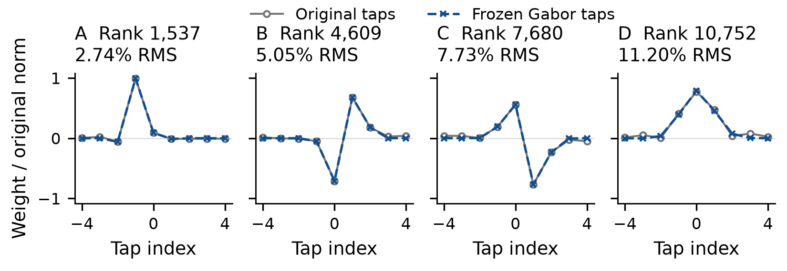

<!-- orukeet-brand:start -->
<p></p>
<!-- orukeet-brand:end -->

# Orukeet

<!-- orukeet-team:start -->
<p>
Nathan Roll<sup>1,2</sup> · Irene Yi<sup>1,2</sup> · Büşra Marşan<sup>1,2</sup><br>
Vianney Grenez<sup>1</sup> · Gabriel Stein<sup>4</sup> · Momcilo Mrkaic<sup>5</sup><br>
Pavle Padjin<sup>5</sup> · Vladimir Zeljkovic<sup>5</sup> · Calbert Graham<sup>1,3</sup>
</p>

<p><strong><sup>1</sup> Oruk AI</strong></p>
<table>
<tr>
<td align="center" valign="middle"><br><sup>2</sup> Stanford University</td>
<td align="center" valign="middle"><br><sup>3</sup> University of Cambridge</td>
<td align="center" valign="middle"><br><sup>4</sup> OpenWhispr</td>
<td align="center" valign="middle"><br><sup>5</sup> Hoid</td>
</tr>
</table>
<!-- orukeet-team:end -->

Orukeet is a 25-language speech recognizer built from NVIDIA Parakeet TDT 0.6B v3. It replaces half of the encoder's temporal depthwise filters with **12,288 fitted, frozen Gabor kernels** and trains the remaining parameters on multilingual and multi-accent data.

Orukeet outperforms Parakeet on **61 of 74 tested splits**, including LibriSpeech test-clean (**1.46% vs. 1.53% WER**), test-other (**2.86% vs. 3.14%**), and FLEURS English (**3.82% vs. 4.28%**). Across all 25 FLEURS languages, pooled WER is **9.85% vs. 11.01%**, a **10.6% relative reduction**. Final adaptation and checkpoint selection use LibriSpeech test-other.

Use Orukeet for recordings, media, batch transcription, server workers and interactive applications. NeMo, ONNX INT8, native Q8 and native F16 all derive from the same **r3 release checkpoint** (`031c8ddab484`).

[Model card](MODEL_CARD.md) · [Weights](https://huggingface.co/oruk/orukeet) · [Technical report](output/pdf/orukeet-technical-report.pdf)

## Run speech recognition

Use Python 3.12+ in an activated virtual environment. Install the prebuilt
v0.1.1 package and download its verified model and native runtime:

```sh
python -m pip install --upgrade \
  https://github.com/Oruk-AI/orukeet/releases/download/v0.1.1/orukeet-0.1.1-py3-none-any.whl
orukeet install --device auto --cache ./orukeet-cache --output installation.json
```

Automatic selection installs the **optimized Metal runtime on Apple silicon**,
CUDA on a detected NVIDIA device, or CPU. The installer verifies the Q8 weights
and SDK hashes. Installing the prebuilt SDK requires no CMake, Ninja or compiler.

Use the saved installation receipt to transcribe locally:

```python
import json
from pathlib import Path
from orukeet import Orukeet

config = json.loads(Path("installation.json").read_text(encoding="utf-8-sig"))
with Orukeet(config["model"], config["runtime"], device=config["device"]) as asr:
    print(asr.transcribe("recording.wav")["text"])
```

A persistent worker keeps the model loaded across files. Input is decoded to
mono 16 kHz and split into bounded windows for long recordings. Existing users
should upgrade the package and rerun `orukeet install` to regenerate their
installation receipt with the new runtime.

[Usage and application workers](docs/usage.md) · [NeMo inference and fine-tuning](docs/gabor-source.md)

To compile the runtime yourself, [build the Metal SDK from source](runtime/README.md).
The kernel patches, attention/cache changes and pinned build script live in `runtime/`.

## Metal performance

**Hoid developed Orukeet's Metal kernel and attention/cache optimizations.**
On Apple M4 Pro with 24 GiB RAM, the patches reduced warm native median latency
by **42.4% (1.74× speedup)** while preserving every transcript in a fixed
24-clip LibriSpeech test-clean benchmark.

| Warm native latency, Q8/Metal | Before optimization | Optimized | Reduction |
| --- | ---: | ---: | ---: |
| Median | 154.2 ms | **88.9 ms** | **42.4%** |
| p95 | 280.8 ms | **156.1 ms** | **44.4%** |

These measurements use 5–30-second clips, exclude model loading and warmup,
and describe the patch benchmark. The packaged v0.1.1 SDK has separate
installation and transcript checks; its full timed benchmark has not been
rerun. [Measurement details and results](runtime/README.md#performance).

## Evaluation

Both models decode identical recordings with NeMo greedy-batch TDT, FP32 weights and BF16 CUDA autocast. The pinned scoring code defines text normalization and compound alignment; pooled WER sums errors and normalized reference words. Lower is better.

| Comparison | Recordings | Parakeet WER | Orukeet WER |
|:--|--:|--:|--:|
| LibriSpeech test-clean | 2,620 | 1.53% | **1.46%** |
| LibriSpeech test-other | 2,939 | 3.14% | **2.86%** |
| FLEURS English | 647 | 4.28% | **3.82%** |
| FLEURS pooled, 25 languages | 20,146 | 11.01% | **9.85%** |
| Accents/domains pooled, 47 splits | 12,006 | 16.72% | **15.25%** |
| Accents/domains English, 20 splits | 5,120 | 9.51% | **8.84%** |

Orukeet improves 25 of 27 complete LibriSpeech/FLEURS splits and 36 of 47 accent/domain splits, including all 20 English accent/domain splits. The accent/domain sample contains 256 recordings per split and all 230 Lesbos recordings; the preceding adaptation includes 6,118 sampled recordings. Read speech and accents/domains have separate pooled results. Every recording contributes to the scores.

[All 74 paired WER/CER scores and edit counts](docs/current-checkpoint-benchmarks.md) · [Methods](docs/technical-report.md) · [Technical report](output/pdf/orukeet-technical-report.pdf)

## Architecture

The model retains Parakeet's 627,008,134 parameters, 24-layer FastConformer encoder, token-and-duration transducer and tokenizer. Each encoder block contains 1,024 nine-tap temporal depthwise filters. A selected filter stores its own fitted Gabor function:

$$g(t)=A\exp\left[-\frac{(t-\mu)^2}{2\sigma^2}\right]\cos\left(2\pi f(t-\mu)+\phi\right),\quad t=-4,\ldots,4.$$

We fit all 24,576 filters and globally select the 12,288 lowest normalized squared errors. This selects 175–748 kernels per layer, with 6.32% median relative RMS error and a 13.30% cutoff. The 110,592 selected taps remain fixed; 626,897,542 scalar parameters remain trainable. Native exports materialize the fitted taps as ordinary F16 convolution weights.



## Construction

Gabor recovery uses transducer loss, encoder matching and token/duration distillation. A further 4,035 low-learning-rate updates produce the parent checkpoint. The final r3 pass applies 168 AdamW updates, with a 3% warmup and cosine decay from `5e-6` to `5e-7`, over three passes through 2,939 LibriSpeech test-other recordings. Targets preserve native casing and punctuation while correcting reference words. The same split supplies checkpoint selection. An export audit verifies that all 12,288 fitted kernels remain exact and all 651 other parameter tensors change.

[Fit and freeze recipe](training/gabor_half/README.md) · [Final adaptation](training/librispeech_ft/README.md) · [Training lineage](training/README.md)

## sherpa-onnx inference

The [ONNX INT8 archive](https://huggingface.co/oruk/orukeet/resolve/55a984d46f68323301837194ce647c702f55facc/onnx/sherpa-onnx-orukeet-v0.1.0-int8.tar.bz2) uses the standard Parakeet TDT v3 layout: `encoder.int8.onnx`, `decoder.int8.onnx`, `joiner.int8.onnx` and `tokens.txt`. It also includes the BPE vocabulary, weight license and attribution. Gabor filters are ordinary convolution weights; the model uses sherpa-onnx's existing offline transducer loader.

The optimized encoder evaluates 24 quantized depthwise convolutions with exactly equivalent FP32 arithmetic using operators already in ONNX Runtime. [Execution details and receipts](evidence/speed20260910/README.md).

Archive SHA-256: `f9191f30178cc9122ce2f023bf9fefafc822028307b0efa4caff645ba3fe8d0a`.

[Export and loader instructions](https://github.com/Oruk-AI/orukeet/blob/main/export/onnx/README.md) · [Conversion evidence](https://github.com/Oruk-AI/orukeet/tree/main/evidence/onnx-r3-20260910)

## Model files

| Format | File | Bytes |
|:--|:--|--:|
| NeMo source | `orukeet-v0.1.0.nemo` | 2,509,342,720 |
| Native Q8 | `orukeet-v0.1.0-q8.gguf` | 714,456,704 |
| Native F16 | `orukeet-v0.1.0-f16.gguf` | 1,296,681,088 |
| ONNX INT8 archive | `onnx/sherpa-onnx-orukeet-v0.1.0-int8.tar.bz2` | 486,807,585 |

All formats derive from **r3**. NeMo and native files are pinned to revision `555136b50265a132d4cea0d35560c26fc4f657ab`; the ONNX archive is pinned to `55a984d46f68323301837194ce647c702f55facc`. The ONNX package occupies 671,619,800 bytes after extraction.

- NeMo SHA-256: `031c8ddab4845aeced904a7cde8e8aa57993b2e344716cf83a545b079c473b56`
- Q8 SHA-256: `93ce19c6d8244acbfea980eeaf970531d4f216171578ef8e041dcc2d070a45bd`
- F16 SHA-256: `de53fb8ec251fb07ade15baabe17b00774ae3f1112f8618b062337f90fb49194`

Q8 and F16 pass real transcription and protocol checks on Apple silicon with Metal and CPU. Conversion audits verify all 12,288 fitted kernels after F16 rounding. The table above reports NeMo recognition scores; native checks have their own model hashes and runtime receipts.

[Artifact catalog](src/orukeet/artifacts.json) · [Native conversion and validation](evidence/r3-promotion-20260908/)

## License and attribution

Code: MIT. Weights and fitted kernels: CC BY-SA 4.0, retaining NVIDIA's foundation attribution. Transcript-free metric records: CC BY 4.0. Dataset audio is obtained from its original providers under their terms.

[Data provenance](docs/data-and-licenses.md) · [Attribution](NOTICE.md)

<!-- orukeet-citation:start -->
## Citation

```bibtex
@techreport{roll2026orukeet,
  title = {{Orukeet}: Multilingual {ASR} with Frozen {Gabor} Kernels},
  author = {Roll, Nathan and
            Yi, Irene and
            Mar{\c{s}}an, B{\"u}{\c{s}}ra and
            Grenez, Vianney and
            Stein, Gabriel and
            Mrkaic, Momcilo and
            Padjin, Pavle and
            Zeljkovic, Vladimir and
            Graham, Calbert},
  institution = {Oruk AI},
  year = {2026},
  type = {Technical report},
  url = {https://github.com/Oruk-AI/orukeet/blob/main/output/pdf/orukeet-technical-report.pdf}
}
```

[Download BibTeX](CITATION.bib) · [Citation metadata](CITATION.cff)
<!-- orukeet-citation:end -->
