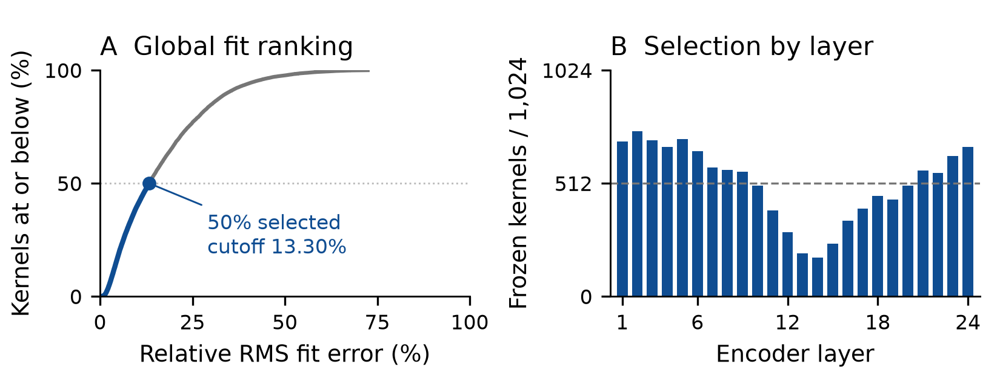

# Orukeet’s fitted Gabor kernels

Each selected nine-tap kernel is replaced by its own fitted function:

$$g(t)=A\exp\left[-\frac{(t-\mu)^2}{2\sigma^2}\right]\cos\left(2\pi f(t-\mu)+\phi\right),\quad t=-4,\ldots,4.$$

We fit all 24,576 original kernels and globally select the 12,288 lowest normalized squared errors. Selection yields 175–748 frozen kernels per layer. The selected fits have 6.32% median relative RMS error and a 13.30% cutoff. Pooled squared error is 0.4244% of the selected original weight energy.

The 110,592 replaced scalar taps remain fixed. All other 626,897,542 parameters train, including the encoder, decoder, joint network and BatchNorm affine terms. BatchNorm running statistics stay fixed. The source checkpoint stores the fitted values as ordinary convolution tensors; native exports use the same operator shapes.

The adaptation pool contains 1,716,650 rows / 2,676.18 hours across 25 languages, built from Common Voice 22, FLEURS and English accent extensions. The recovered history comprises 20,000 training steps, a 4,000-step cooldown, and an 800-step anchored continuation blended 75:25 with stock weights.

Gabor recovery trains against the adaptation baseline with transducer loss, encoder/block matching and token/duration distillation. It first produces R15-0100 after 2,900 updates along its longest recovery ancestry. FT-4035 follows with 4,035 low-learning-rate updates. The final r3 continuation applies 168 updates and supplies all current NeMo, Q8 and F16 downloads. All 12,288 frozen rows remain bit-exact. Fit sidecars, optimizer coverage, recipes and ancestry are recorded in the repository.

[Exact fit algorithm and optimizer groups](../training/gabor_half/README.md) · [Every-layer kernel atlas](../report/assets/kernel-atlas.pdf) · [Report](../output/pdf/orukeet-technical-report.pdf)
