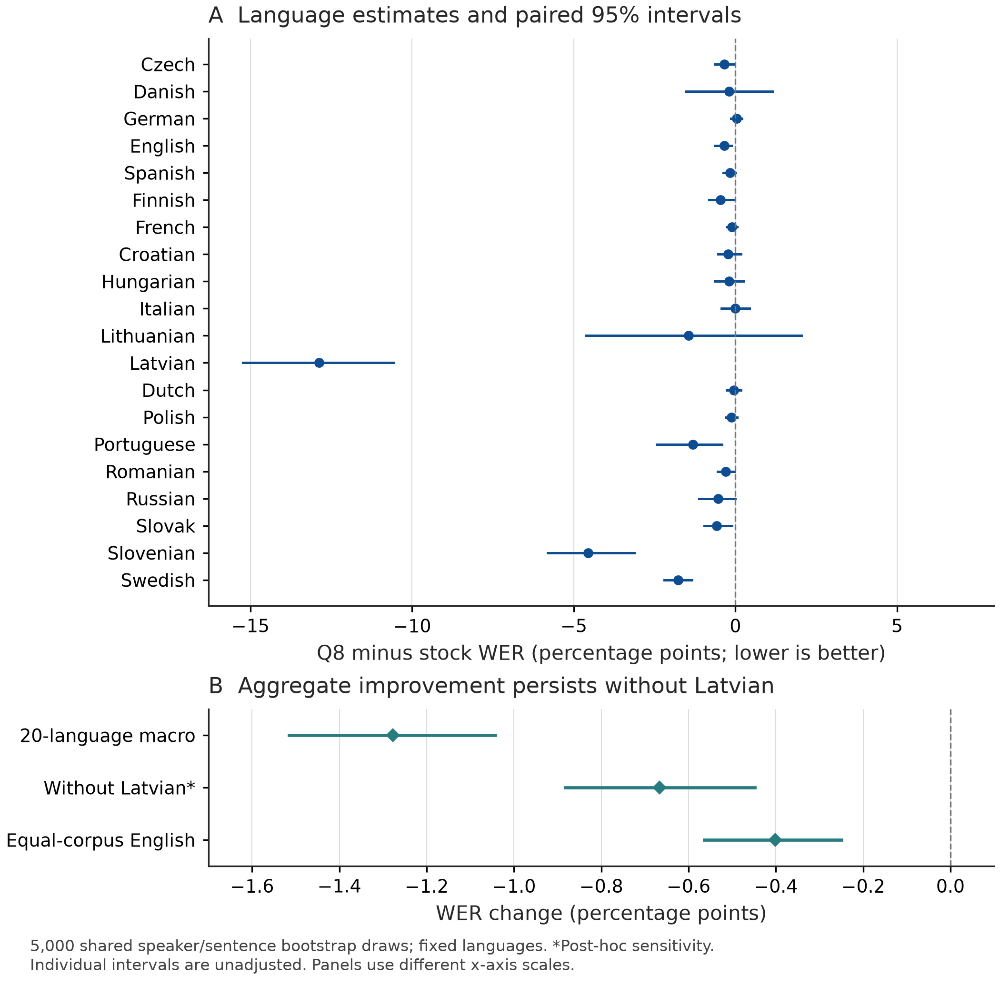
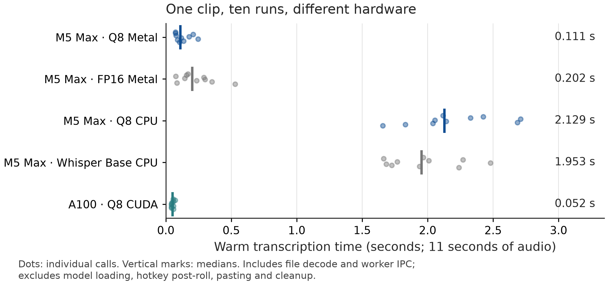

# Historical adaptation and deployment record

The dated experiment narrative below records the checkpoint and release decisions at that time. Current downloads are r3; historical default and export-status statements describe the earlier campaign.

This record preserves the earlier adaptation baseline and export campaign. Current Orukeet is r3; its model description and measurements are in [the current report](technical-report.md).

# Orukeet
## Multilingual training and Gabor surgery for NVIDIA Parakeet

Oruk AI · Release candidate 0.1 · September 2026 · Private review

The [four-page NeurIPS-format report](../output/pdf/orukeet-technical-report.pdf)
and its [LaTeX source](../report/paper.tex) are the concise release report. This
page retains the detailed adaptation, deployment and recovery history. Orukeet
is a surgical refinement of NVIDIA Parakeet through additional multilingual
and accent training, followed by fitted, frozen Gabor kernel experiments.

**Stage boundary:** the canonical source/Q8 and the 16.58% → 15.30% result
below precede Gabor surgery. R15-0100 passes all source-model accuracy gates;
both native exports fail separate accuracy gates, and downloads have not changed. [Exact stage identities](../release/model-stages.json).

Orukeet starts with a practical question: can we improve Parakeet across
languages and accents while keeping it useful as a general ASR model? We
fine-tune NVIDIA Parakeet TDT 0.6B v3 and release the source checkpoint, a
compact native export and the work needed to inspect them. The model belongs
in transcription services, batch pipelines, media tools and speech-enabled
applications. Dictation is one application.

The result is useful and uneven. On our fixed suite of 23,038 recordings,
the deployed Q8 model reduces 20-language macro word error rate (WER) from
16.58% to 15.30%, or 7.70% relative. Nineteen language point estimates improve.
Latvian accounts for about half the aggregate change; excluding it leaves a
4.24% relative improvement. The original source-model promotion gate failed
its 10% target. We keep that result in the report.

The deployment file is 714,456,736 bytes. An 11-second recording takes a median
111 ms on an M5 Max with Metal and 52 ms on an A100 with CUDA, measured through
the historical file harness's audio decoding and worker protocol (§6). CPU performance is less
exciting: 2.13 seconds on the same Mac, slightly slower than Whisper Base.
These timings describe a warm decoder on one short recording. They do not
describe every machine, recording domain or complete application interaction.

## 1. What changed

Orukeet uses the existing FastConformer encoder, token-and-duration transducer
(TDT), and tokenizer from Parakeet v3. NVIDIA supplies the multilingual
foundation model; this work supplies an adaptation, export validation, native
application integration, and the evidence needed to inspect them. The upstream
model covers 25 European languages and is distributed under CC BY 4.0.
[Parakeet model card](https://huggingface.co/nvidia/parakeet-tdt-0.6b-v3).

The pre-surgery checkpoint is a linear interpolation:

**θ_orukeet = 0.25 θ_stock + 0.75 θ_anchored-continuation.**

Interpolation produces one ordinary model. It adds no ensemble, routing,
second decoder, or inference-time language model. We chose the 0.75 fraction
over 0.50 on a frozen development suite before running confirmation. Weight
averaging has prior support as a way to reduce forgetting in ASR; the exact
choice here is empirical and specific to this campaign.
[Related ASR work](https://arxiv.org/abs/2210.15282),
[selection record](../evidence/selection_development_decision.json).

The source checkpoint's SHA-256 begins `313d615ca34c8ac3`; the Q8 export's
begins `8967e04bd73fd8e88`. Full hashes, the unchanged tokenizer hashes,
intermediate checkpoints and download revisions appear in
[artifact metadata](../src/orukeet/artifacts.json) and
[lineage](../evidence/stage3_baseblend_a075_20260905.lineage.json).

### Gabor surgery and the recovery result

Fit every one of the 24 × 1,024 nine-tap temporal depthwise kernels of the exact
pre-surgery source with a real Gabor function. Select the 12,288 lowest
normalized squared errors globally, freeze those fitted functions/taps, and
train every other parameter. Pointwise mixing and the subsampler remain
trainable. Selected median relative RMS fit error is 6.32%; cutoff is 13.30%.
The fixed taps are 110,592 scalar weights, not half the model. Export materializes
them into ordinary convolutions; there is no added inference operator or
established speedup from surgery. The [method and fit sidecars](../training/gabor_half/README.md)
record bounds, initialization, tie breaks, tests and exact hashes.

R15 trains all 626,897,542 remaining scalars (651 tensors). One frozen
pre-surgery teacher supplies masked, energy-normalized hidden-state targets
and sampled token/duration posteriors. Its objective is 0.1 ASR + 50 block MSE
+ 25 conv-branch MSE + token KL + duration KL. The sampled Cartesian grid uses
16 valid acoustic and 16 transcript-prefix positions per utterance, not full-sum
transducer distillation. BatchNorm statistics stay fixed; affine parameters train.
The final continuation samples 80% of the existing balanced mixture plus 20%
of its English Common Voice/FLEURS subset. Exact recipes and every prior
experiment remain in the [recovery ledger](../training/gabor_half/README.md#r15-english-sampling-with-the-shared-teacher).

| R15-0100 matched NeMo endpoint | Before surgery | Gabor recovery | Change / paired 95% interval |
| --- | ---: | ---: | --- |
| Larger 20-language macro WER | 15.3713% | 15.3409% | −0.0304 pp [−0.1410, +0.0618] |
| Larger English seven-corpus macro | 9.3603% | 9.3592% | −0.0011 pp [−0.0493, +0.0471] |
| Development primary WER | 10.0822% | 10.0116% | −0.0706 pp; no CI |

R15-0100 passes both mean gates, every individual language/corpus guard and
all development guards. The primary language macro uses 13,246 recordings/46
slices within the total 23,038-recording larger suite. Included source/language
strata need at least five resampling groups; primary languages need at least
twenty recordings. Bulgarian, Estonian, Maltese and Ukrainian remain descriptive
there, while development still checks them. The intervals cross zero, so the
small point-estimate gains do not establish significance or equivalence.

The [count bundle](../training/gabor_half/results/metric-r15-0100.tar.gz) and
[CPU reproduction script](../training/gabor_half/reproduce_metric_evidence.py)
reproduce every development and larger statistic exactly without raw audio or
transcripts. [Executed selection](../training/gabor_half/results/r15-full-selection.json)
evaluates step 100 first and stops after the first pass. The later step-200
fallback is recorded separately after native export failures. The selected checkpoint's [ancestry](../training/gabor_half/results/r15-0100-ancestry.json)
contains 2,900 recovery updates along its longest path and an earlier parameter
average. This is one adaptive campaign, not 100 updates from the original.

The evaluation has informed selection. These continuations cannot establish
new-data generalization or a causal benefit of Gabor structure. Native Q8
accuracy and runtime checks are separate; existing demos and timings below
remain pre-surgery evidence unless explicitly labeled otherwise.

## 2. Recovering a training history worth trusting

The starting point was a September 4 campaign recovered from Cursor logs,
source code, manifests and saved checkpoints. Its first stage ran 20,000
steps, followed by a 4,000-step cooldown and EMA export. Those stages used
Common Voice 22 and FLEURS. Historical test results had already influenced
checkpoint choices; LibriSpeech test-other also appeared in the validation
loader. Their old scores therefore cannot serve as untouched confirmation.

We preserved the historical artifacts, audited the data again, and treated
the recovered stage-2 EMA as initialization. An initial 800-step continuation
failed its comparison against stage 2. The subsequent experiment selected the
blended candidate against **stock Parakeet**, a different baseline. Both
outcomes remain part of the history. A newer file is not automatically a
better model.

For the anchored continuation, only the upper six encoder layers train:
151,136,256 parameter elements. The decoder, joint network, vocabulary,
preprocessor, earlier encoder layers and BatchNorm statistics stay fixed.
A frozen copy of the initialization encoder supplies a cosine-distance
representation penalty on the same features as the student.

| Setting | Value |
| --- | --- |
| Optimizer | AdamW; β₁=0.9, β₂=0.98; weight decay 0.001 |
| Learning rate | 2 × 10⁻⁶; cosine decay to 5 × 10⁻⁷ |
| Warmup / optimizer steps | 50 / 800 |
| Anchor coefficient | 0.1 |
| Precision / seed | bf16-mixed / 20260905 |
| Batch duration / accumulation | 160 seconds / 2 |
| SpecAugment | 2 frequency masks, 2 time masks |
| Hardware | One NVIDIA A100 40 GB |

This was a bounded sample from a pool, not an epoch over all its audio. The
recorded final ASR training loss was 0.1710; that number is an optimization
diagnostic, not a quality score. Captured launch arguments and the live
optimizer log are authoritative: the exported model inherited stale optimizer
metadata from its initialization.
[Training provenance](../evidence/training_provenance.json),
[exact arguments](../evidence/training_argv.json).

## 3. The data we used

The continuation pool contains **1,716,650 rows / 2,676.18 hours**. Most comes
from Common Voice 22 and FLEURS across 25 languages. A small English extension
adds 5,973 English Dialects clips (9.82 hours) and 2,254 SpeechOcean762 clips
(2.57 hours). The extension receives 8% of sampling probability; all English
groups together receive 19.53%.

We normalize transcripts to NFC, preserve their original form and provenance,
and exclude training rows whose known identities or normalized sentences
occur in protected partitions. A cross-language Common Voice speaker filter
removes another 74,618 rows. Training duration is restricted to 0.4–20 seconds.
Sampling balances language and source by square-root duration; accent-label
upsampling is capped at three times its empirical within-source frequency.
Unknown accent labels stay unknown.

Every retained extension file was decoded, converted to 16 kHz mono PCM16,
checked for finite/nonempty samples and deduplicated using normalized PCM
hashes. The broader inherited multilingual pool received metadata and file
existence checks; we do not describe that as an exhaustive acoustic
near-duplicate audit.

Common Voice's free-text accent labels are messy. The audit found 437 distinct
English label strings before the additional global speaker exclusion. That is
not evidence of 437 distinct accents. SpeechOcean is Mandarin-L1 English
learner speech, including children and adults, collected for pronunciation
assessment. Its prompted references can disagree with what a learner actually
said. WER there measures prompt agreement as well as recognition.
[SpeechOcean762](https://www.openslr.org/101/).

Other holdings on the original machines, including restricted and untranscribed
corpora, were inventoried separately. They were not silently added to this
continuation. The [data report](data-and-licenses.md) distinguishes the actual
training pool from broader holdings and lists acquisition and license sources.

## 4. Evaluation, including the awkward parts

The confirmation suite contains **23,038 recordings / 53.67 hours**, grouped
into 61 slices. Twenty languages meet the fixed primary coverage rule of at
least 20 source-qualified speaker or sentence groups. Within each language,
we pool edit errors and reference words across its registered source slices.
We then average the 20 language WERs equally. The English endpoint separately
averages seven corpus WERs equally.

This macro metric answers a particular question: how well does the system do
when these languages count equally? It does not estimate traffic-weighted
accuracy for an app with an unknown user population.

Greedy source-model evaluation uses bfloat16 NeMo inference. Deployment
evaluation uses the native Q8 runtime. References receive the same
legacy-compatible NFC, case and punctuation normalization, including retained
language-specific character mappings. This is a custom fixed suite, not an
official FLEURS, Common Voice or Open ASR Leaderboard score.

Uncertainty uses 5,000 **paired global cluster bootstrap** replicates, seed
20260905. Each draw reweights the same 4,266 clusters for both systems. Speaker
identities are qualified by source; parallel FLEURS sentences share a cluster
across languages because speaker identities are unavailable. Error and word
counts are recomputed before taking the macro average. Languages remain fixed.

| Endpoint | Stock Parakeet | Source Orukeet | Deployed Q8 |
| --- | ---: | ---: | ---: |
| 20-language macro WER | 16.581% | 15.371% | **15.304%** |
| Equal-corpus English WER | 9.725% | 9.360% | **9.324%** |

The Q8-minus-stock primary difference is **−1.277 percentage points**,
with a paired 95% interval **[−1.515, −1.043]**. The English difference is
**−0.401 points [−0.564, −0.250]**. These intervals support average improvement
for this fixed suite and resampling scheme.
[Full comparison](../evidence/q8-vs-stock.json).

### Latvian deserves its own paragraph

Latvian WER falls **33.20% → 20.33%**, a 12.87-point change across 427
recordings. Its equal-language contribution explains about 50.4% of the overall
macro reduction. Excluding Latvian, macro WER still falls **15.706% → 15.039%**:
**4.24% relative**, or **−0.666 points [−0.882, −0.448]**. This is a post-hoc
sensitivity analysis, explicitly separate from the sealed primary endpoint.

Nineteen of twenty language point estimates improve; German increases by
0.041 points. The median language change is −0.316 points. Individual language
intervals are descriptive and have no simultaneous-comparison correction.
We cannot infer a dependable gain for every language, speaker, accent or
domain from the average.
[All leave-one-language-out results](../evidence/release-sensitivity.json).

### The original gate still failed

The source-model confirmation improved macro WER by 7.29% relative, below the
predeclared 10% target. Danish FTSpeech also worsened by 0.209 points. The
protocol required family-level improvement, so the full promotion gate failed.
The deployed Q8 result remains below the 10% target too.

The native Q8 export differs from the source NeMo run by −0.068 macro WER
points, with interval **[−0.259, +0.054]**. The observed difference is small;
runtime and precision both change, and no equivalence margin was specified.
This comparison neither isolates quantization nor proves that Q8 improves accuracy. The same recordings were
already evaluated during confirmation; replaying them through a new export is
a deployment regression check, not fresh held-out evidence.
[Source result](../evidence/source-model-accuracy.json),
[Q8/source comparison](../evidence/q8-vs-source.json).

## 5. Deployment as an ASR component

The release offers two entry points: the source `.nemo` model for NeMo
inference/fine-tuning, and a Q8 GGUF for the standalone native API. The same
native recognizer can sit in a desktop application or a server worker. The
CLI processes one or more local audio files; an application is responsible
for uploads, access control and request scheduling when serving it remotely.

NeMo-Speech.cpp v0.1.0 supplies the native recognizer. We pin all SDK archives,
the converter revision and the model hash. Q8 saves **44.9%** of file size
relative to the 1,296,681,120-byte FP16 export. Model weights stay loaded in a
serial worker process. Cancellation terminates the worker; reloading restores
service. Audio decoding keeps a fixed buffer and chooses quiet boundaries
between roughly 24 and 30 seconds for long files.

Mac Auto selects Metal on Apple silicon. A detected NVIDIA GPU selects CUDA;
CPU is the general fallback. Explicit GPU requests fail visibly if unavailable. Vulkan is
offered explicitly. The native recognizer processes bounded audio windows;
interactive applications can build previews around it. Neither this wrapper
nor the selected source checkpoint is presented as a stateful streaming ASR
architecture. The [usage guide](usage.md) covers batch and application use.

An early conversion omitted the source mel filterbank because a converter
dependency was missing. That export was rejected. Both final exports retain
the exact source filterbank, and the export wrapper now requires the dependency
instead of accepting the fallback. SHA-256 validation applies to public and
private model loads alike. Warm calls do not repeat the hash.
[Mel parity](../evidence/mel-parity.json),
[native runtime](https://github.com/NVIDIA/NeMo-Speech.cpp/tree/v0.1.0).

## 6. How fast, on which machine

The table reports medians of ten warm calls through the historical
Knuckles92/OpenWhisper file-transcription harness: decoding,
windowing and worker IPC. The input is the public 11-second JFK sample. Model
initialization, hotkey post-roll, clipboard delivery and optional text cleanup
are excluded. The M5 Max has 18 CPU cores and 128 GiB unified memory; the
server uses an A100 40 GB.

| Machine / engine | Seconds | Audio / processing time |
| --- | ---: | ---: |
| M5 Max · Orukeet Q8 · Metal | **0.111** | **99.4×** |
| M5 Max · Orukeet FP16 · Metal | 0.202 | 54.4× |
| M5 Max · Orukeet Q8 · CPU | 2.129 | 5.2× |
| M5 Max · Whisper Base · CPU int8 | 1.953 | 5.6× |
| A100 40 GB · Orukeet Q8 · CUDA | **0.052** | **212.2×** |

Metal Q8 is 17.7 times faster than the existing Mac Whisper Base/CPU path on
this clip. That comparison includes both a model change and hardware
acceleration. It does not isolate an architectural speed advantage. On CPU,
Orukeet is about 9% slower than the much smaller Whisper Base.

Repeating the sample gives 66- and 308-second capacity probes. Metal Q8 takes
0.745 and 2.611 seconds respectively. Those repetitions test processing
capacity, not recognition quality on a long conversation. Longer Whisper
baseline runs were interrupted and excluded. We do not fill missing results
with estimates.

Peak sampled process-tree RSS was 1.11 GB for the Metal Q8 benchmark and
0.40 GB for CUDA. These are host-process measurements, not complete GPU memory
accounting or tested minimum RAM requirements. The 714 MB figure is the weight
file size.

Model initialization was measured after hashing, with a warm OS file cache.
Ten repeats provide a useful median but an unstable tail-latency estimate.
Background load varied on the Mac. More hardware and natural long recordings
are needed before making broad speed claims.
[Individual measurements](../evidence/mac-metal-q8.json),
[CPU comparison](../evidence/mac-cpu-q8.json),
[A100 measurements](../evidence/a100-cuda-q8.json).

## 7. Runtime validation and application evidence

The standalone package passes model integrity, worker lifecycle, bounded
windowing, resampling, silence and error-recovery checks. A clean install from
the private Hub wheel transcribed a Unicode-named file twice with Hub offline
mode enabled. Actual Q8 inference passed on Windows x64, Linux x64 and Apple
silicon CPU paths; Metal and A100 CUDA have separate real-model receipts.
[Clean package install](../evidence/hub-clean-install.json),
[package checks](../evidence/package-launch-tests.json),
[native CI](../evidence/native-ci.json).

Earlier application work exercised the Qt-based Knuckles92/OpenWhisper fork
with CPU/Metal, cancellation, reload, uploads, preview and a meeting queue.
Its microphone/meeting tests use fixtures. This is historical runtime evidence;
that project is different from the Electron-based OpenWhispr/openwhispr app.
Those tests do not establish that the intended OpenWhispr integration works.
The OpenWhispr PR preparation is separate from the Orukeet model release.
[Historical Qt receipt](../evidence/qt-app-metal.json),
[packaged-worker receipt](../evidence/frozen-smoke.json).

Physical capture, permission dialogs, hotkey/paste delivery and live meeting
capture remain application-specific validation. Vulkan, Intel Mac and Linux
ARM64 hardware have not been exercised. General-purpose ASR positioning does
not turn unmeasured workflows into tested capabilities.

## 8. Release scope and remaining uncertainty

This repository is a private review candidate for an open release. It includes
inference code, export and fine-tuning code, historical recipes, intermediate
checkpoint references, evaluation definitions, per-recording error counts and this
report. The proposed final-weight license is CC BY-SA 4.0, with upstream
attribution retained; code is MIT. The [release review](release-review.md)
tracks the remaining publication decisions.

Openness needs a precise boundary. We can document and share Orukeet's
adaptation and deployment artifacts. We cannot promise an exact reproduction
of NVIDIA's foundation pretraining or certify its full overlap with public
evaluation data. We make no claim of Open Source AI Definition certification.
[OSI definition](https://opensource.org/ai/open-source-ai-definition).

Known evaluation weaknesses also remain: inherited Common Voice speaker hashes
are truncated; real people may occur across corpora; FLEURS clusters sentences
rather than speakers; some parliamentary references are not verbatim; most
English Dialects holdout prompts recur elsewhere; and the confirmation set is
now consumed. Another outcome-informed model revision needs a newly frozen
confirmation set.

We would like the next revision to earn a less qualified result: broader
microphone and conversational coverage, better CPU latency, a cleaner
unseen-speaker evaluation, and fewer weak languages. For this release, the
useful promise is narrower: an inspectable Parakeet adaptation that improves
the measured average and runs quickly in the native GPU paths we tested.

## Reproduction map

| Task | Entry point |
| --- | --- |
| Fetch exact Q8/source/intermediate weights | `orukeet fetch` and `src/orukeet/artifacts.json` |
| Run local files | `orukeet transcribe` or the `Orukeet` Python class |
| Recreate filtering and sampling | `training/README.md` |
| Run anchored continuation and blend | `training/finetune_anchored.py`, `training/selection/blend_models.py` |
| Re-export and verify mel filters | `evaluation/export_oruk_native.py` |
| Replay the fixed deployment suite | `evaluation/evaluate_oruk_export.py` |
| Recompute paired CIs and sensitivity | `evaluation/compare_oruk_export.py` |
| Redraw figures and this PDF | `scripts/make_figures.py`, `report/make_surgery_figure.py`, `scripts/build_neurips_report.py` |

## Recovery update after the four-page report snapshot

Earlier report snapshots documented R6-0400; the current compact report records
R15-0100. R7-0300 subsequently
improved development WER to 9.969561% and larger English WER to 9.299936%, while
the larger multilingual mean remains 15.391870% versus 15.371307% originally.
Bulgarian/Latvian development guards still fail; all individual larger guards pass.
[The exact R7 result](../training/gabor_half/results/full-r7-0300.json) remains unqualified.

R8 ran another 400 steps. All four exports preserve the exact 12,288 fitted rows,
all 651 remaining parameter tensors received finite gradients, and BatchNorm
running statistics remain unchanged. Its lowest-development-WER export is step
100: 9.975037%, with Common Voice Bulgarian/Latvian and FLEURS Finnish still
over their language limits. The [larger result](../training/gabor_half/results/full-r8-0100.json)
is 15.421902% multilingual and 9.268413% English. The multilingual mean and Danish
guard fail. English improves, but the candidate remains unqualified.

R9 is a 600-step continuation from R8-0100 with the same fitted kernels and loss.
It increases the original-mixture sampling share to 60%, assigns 20% to the three
failing source/language pairs and retains 20% English/accent emphasis. A new
sampling seed changes minibatch order within the same audited training membership.
All three exports received the unchanged development checks. Step 600 has the
lowest WER, 9.951292% versus 10.082235% originally, but Italian still rises by
0.610998 points. Its [larger comparison](../training/gabor_half/results/full-r9-0600.json)
scores 15.451277% multilingual and 9.334745% English. All individual larger
guards pass; the multilingual mean and development failure prevent qualification.

R10 tests a 400-step continuation with more recovery capacity in the trainable
convolutions around the fixed rows. It restores the original sampling mixture,
raises the 120 convolution tensors' learning rate to 2e-5 and increases branch
reconstruction weight to 5. Every other parameter continues training at its
previous positive learning rate. Both exports passed the exact-kernel audits but
failed development guards. Step 400's [larger comparison](../training/gabor_half/results/full-r10-0400.json)
scores 15.396722% multilingual and 9.641385% English. Both means, Danish and the
English learner guard fail. The lower development mean, 9.926624%, did not
predict preservation of larger-suite English accuracy.

R11 repeats the same R9 initialization, data, seed, learning rates and 400-step
horizon with a stronger teacher objective: 0.1 ASR + 50 block-reference + 25
convolution-reference. All remaining parameters train and the same fitted rows
stay fixed. Both exports passed independent kernel audits. The final export
scores 10.011194% development WER and misses only FLEURS Finnish, by one error
beyond its allowed count. Its [larger result](../training/gabor_half/results/full-r11-0400.json)
is 15.379119% multilingual versus 15.371307%, and 9.356939% English versus
9.360330%. Every larger individual guard passes; the multilingual mean and
development failure still prevent qualification.

A1 prepares three declared averages of R2-0100, R7-0300 and R11-0400, preserving
the fitted rows, buffers and checkpoint metadata exactly. The
[recovery record](../training/gabor_half/README.md#r11-result-and-declared-a1-averages)
gives the weights and stopping rule. All three development means beat the
original, but individual language guards fail. The best mean, 9.954121%, receives
the declared diagnostic larger comparison: multilingual WER improves to
15.352255%, but English regresses to 9.406349%. R12 continued from R11 for
800 steps with the same teacher objective. Its final development WER is
10.010372%, missing only the Latvian guard by one excess word error. The
[larger result](../training/gabor_half/results/full-r12-0800.json) is 15.379236%
multilingual and 9.357365% English: the primary mean still fails, while English
and every larger individual guard pass. A2 tested three declared averages of
R11 and R12. The 65% R12 average passes all development checks at 10.020236%
WER. Its [larger result](../training/gabor_half/results/full-a2-0650.json) improves
the multilingual mean to 15.360944% but regresses English to 9.372779%; individual
guards all pass. R13's short English-emphasized continuation passes development
at step 300, but scores 15.399187% multilingual and 9.366059% English on the
larger suite; both means fail. R14 adds sampled token/duration matching to the
hidden-state teacher. Its step-200 export passes development and improves the
larger multilingual mean to 15.348847%, but English remains 9.367143%, above
the original 9.360330%. A3's three averages with R7 all fail development; the
15% average's larger English result is 9.371242%. R15 returns to R14-200 for
200 updates with more English sampling and the same shared teacher. Both exports
pass development. Step 100 scores 15.340887% multilingual and 9.359238% English
on the larger suite and passes every source gate; the original selection stops
there. After native failures, the already-trained step-200 export also passes
the source suite (15.354356% multilingual, 9.333105% English). Its Q8 export
fails one native development Russian guard. One mixed export keeps seven transducer matrices in F16 and every other Q8
tensor byte fixed. It passes development but fails the larger multilingual
mean (15.376543% versus 15.303734%) and Lithuanian guard. English improves
to 9.304915% versus 9.323968%. All three OS fixture checks and the real
Electron lifecycle pass; latency is not run after the accuracy failure. These are adaptive comparisons, with no
independent-generalization claim. Canonical weights remain pre-surgery. No
later result is substituted into an earlier experiment's table.

**Native precision check:** the R15-0100 Q8 export improves the 5,100-clip
development mean (10.0534% versus 10.1018%) but fails the Latvian/Ukrainian
Common Voice and Lithuanian FLEURS guards. It is not deployment-qualified.
F16 passes native development but fails the larger regression: multilingual WER is
15.3720% versus 15.3037%, English is 9.3604% versus 9.3240%, and Lithuanian
exceeds its guardrail. Neither native export qualifies; defaults remain unchanged.
