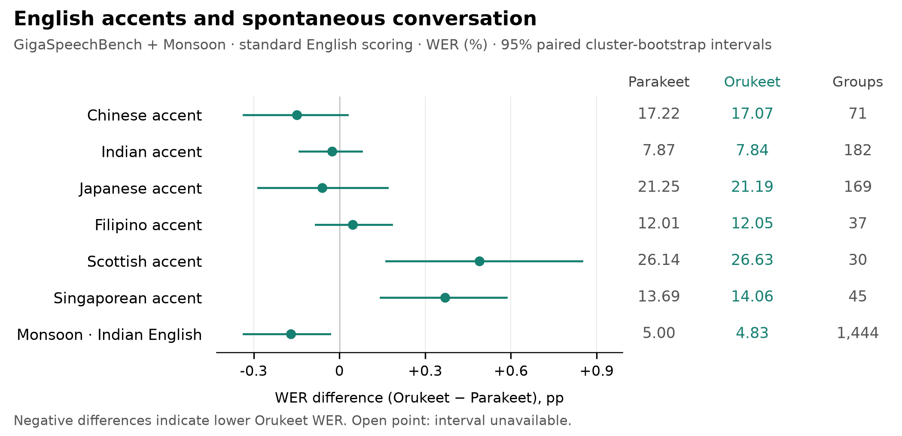
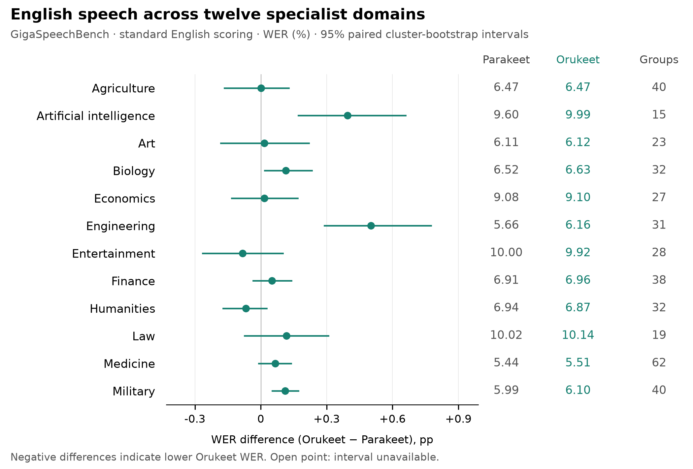
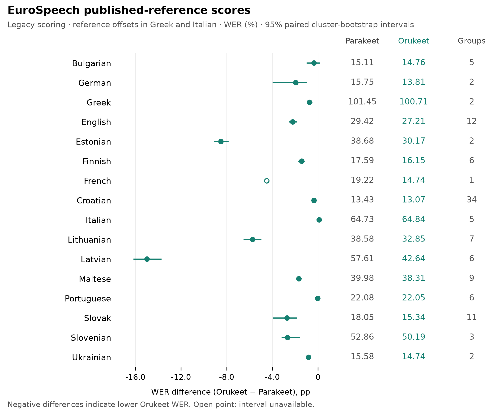
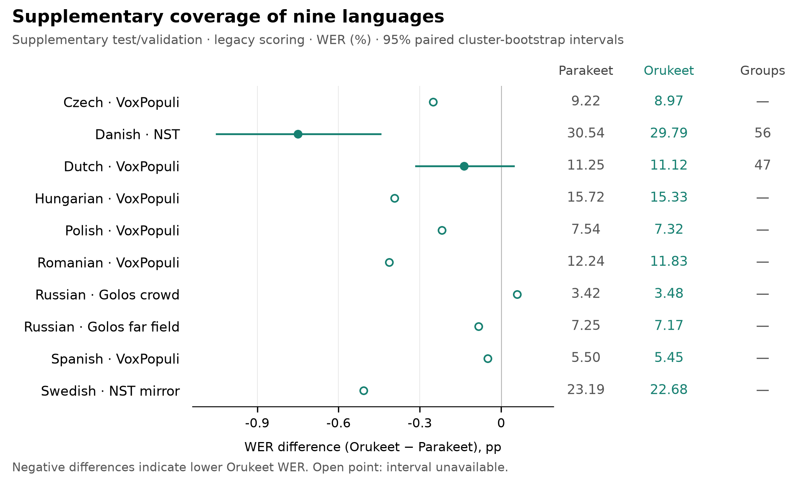

# Orukeet versus stock Parakeet on new evaluation splits

We froze Orukeet R15-0100 and NVIDIA Parakeet TDT 0.6B v3, then transcribed **327,888 clips / 756.02 decoded hours across 47 splits and all 25 supported languages**. Each model processed the same audio with the same NeMo decoder. Neither checkpoint was trained, tuned, blended, or selected using these results. These splits are now evaluation-exposed and must not be presented as fresh confirmation for future checkpoint selection.

The comparison has three separately sealed parts: a 35-split primary suite, a ten-split language-coverage extension, and two checks added after a reference-alignment defect surfaced. The extensions were sealed before their own inference, after some primary results were known. The tables preserve that distinction.

## Primary endpoints

Under standard English scoring, Orukeet reduces Monsoon WER by 3.42% relative. Its six-accent and twelve-domain macro WERs increase by 0.68% and 1.40%, respectively. The same directions hold after the exact-overlap exclusions.

In the separate nine-language extension, Orukeet has lower WER on nine of ten splits. Russian crowd speech regresses. Italian VoxPopuli is nearly unchanged, and both models perform poorly on the short Greek-dialect follow-up.

WER is a percentage; lower is better. Δ is Orukeet minus Parakeet in percentage points. Positive relative reduction favors Orukeet; a negative value is a regression. Each macro averages its fixed split WERs equally.

| Endpoint and scoring | Parakeet WER | Orukeet WER | Relative WER reduction | Δ pp (95% interval) |
| --- | ---: | ---: | ---: | ---: |
| Six English accents · standard English | 16.364 | 16.476 | -0.68% | +0.112 [+0.024, +0.201] |
| Six English accents · legacy | 17.778 | 17.969 | -1.07% | +0.190 [+0.093, +0.290] |
| Twelve English domains · standard English | 7.395 | 7.498 | -1.40% | +0.103 [+0.057, +0.150] |
| Twelve English domains · legacy | 9.043 | 9.496 | -5.01% | +0.453 [+0.387, +0.522] |
| Monsoon Indian English · standard English | 4.996 | 4.825 | +3.42% | -0.171 [-0.335, -0.033] |
| Monsoon Indian English · legacy | 6.163 | 5.660 | +8.17% | -0.503 [-0.682, -0.349] |
| 16 EuroSpeech languages¹ · legacy | 35.009 | 31.973 | +8.67% | -3.036 — |

¹ EuroSpeech has reference-alignment defects in sampled Greek and Italian source material. The 16-language macro remains the registered published-reference score, but it is not reliable headline evidence of general recognition accuracy. The French partition contains only one recording session, so the full macro has no cluster-bootstrap interval.

Standard English scoring uses `whisper-normalizer` 0.1.12. Legacy scoring uses the predeclared NFC/punctuation/character mapping from the earlier Orukeet evaluator. Both are reported; neither is an official leaderboard submission.

## English accents and conversation

Full published splits, standard English normalization.

| Split | Clips | Hours | Parakeet WER | Orukeet WER | Δ pp | 95% interval for Δ | Groups |
| --- | ---: | ---: | ---: | ---: | ---: | ---: | ---: |
| GigaSpeechBench · Chinese accent | 6,308 | 9.43 | 17.222 | 17.073 | -0.148 | [-0.335, +0.028] | 71 |
| GigaSpeechBench · Indian accent | 5,503 | 11.08 | 7.870 | 7.844 | -0.026 | [-0.140, +0.078] | 182 |
| GigaSpeechBench · Japanese accent | 9,310 | 9.75 | 21.255 | 21.194 | -0.061 | [-0.284, +0.168] | 169 |
| GigaSpeechBench · Filipino accent | 8,637 | 10.75 | 12.008 | 12.055 | +0.047 | [-0.083, +0.183] | 37 |
| GigaSpeechBench · Scottish accent | 12,829 | 11.23 | 26.145 | 26.635 | +0.490 | [+0.163, +0.848] | 30 |
| GigaSpeechBench · Singaporean accent | 9,480 | 10.75 | 13.686 | 14.056 | +0.370 | [+0.144, +0.584] | 45 |
| Monsoon · Indian English | 2,102 | 5.62 | 4.996 | 4.825 | -0.171 | [-0.335, -0.033] | 1,444 |

## English specialist domains

Full published splits, standard English normalization.

| Split | Clips | Hours | Parakeet WER | Orukeet WER | Δ pp | 95% interval for Δ | Groups |
| --- | ---: | ---: | ---: | ---: | ---: | ---: | ---: |
| GigaSpeechBench · Agriculture | 6,665 | 10.32 | 6.469 | 6.470 | +0.001 | [-0.165, +0.127] | 40 |
| GigaSpeechBench · Artificial intelligence | 5,468 | 10.46 | 9.597 | 9.992 | +0.395 | [+0.171, +0.659] | 15 |
| GigaSpeechBench · Art | 5,712 | 10.11 | 6.107 | 6.124 | +0.017 | [-0.183, +0.219] | 23 |
| GigaSpeechBench · Biology | 5,297 | 10.50 | 6.517 | 6.631 | +0.114 | [+0.018, +0.233] | 32 |
| GigaSpeechBench · Economics | 5,659 | 10.57 | 9.085 | 9.101 | +0.016 | [-0.132, +0.168] | 27 |
| GigaSpeechBench · Engineering | 6,648 | 11.60 | 5.662 | 6.163 | +0.501 | [+0.290, +0.775] | 31 |
| GigaSpeechBench · Entertainment | 8,583 | 10.12 | 10.003 | 9.920 | -0.083 | [-0.264, +0.100] | 28 |
| GigaSpeechBench · Finance | 6,037 | 11.43 | 6.910 | 6.961 | +0.051 | [-0.034, +0.140] | 38 |
| GigaSpeechBench · Humanities | 4,971 | 10.03 | 6.937 | 6.869 | -0.068 | [-0.172, +0.028] | 32 |
| GigaSpeechBench · Law | 7,273 | 10.32 | 10.024 | 10.141 | +0.117 | [-0.074, +0.307] | 19 |
| GigaSpeechBench · Medicine | 5,168 | 10.31 | 5.441 | 5.507 | +0.066 | [-0.010, +0.138] | 62 |
| GigaSpeechBench · Military | 5,224 | 11.20 | 5.988 | 6.100 | +0.112 | [+0.052, +0.171] | 40 |

### Where the error differences come from

The following decomposition uses the same fixed split weights as the English endpoints. Values are differences in errors per 100 reference words; the three components sum to Δ WER. The selected Levenshtein alignment determines the split between substitution, deletion and insertion, while total edit distance is invariant.

| Endpoint · standard English | Δ substitutions | Δ deletions | Δ insertions | Δ WER |
| --- | ---: | ---: | ---: | ---: |
| Six accents | +0.017 | +0.426 | -0.332 | +0.112 |
| Twelve domains | +0.006 | +0.281 | -0.183 | +0.103 |
| Monsoon | +0.012 | +0.014 | -0.197 | -0.171 |

## EuroSpeech: the published-reference comparison

All official segments in the 16 selected language test splits remain in these legacy-normalized scores. The groups column counts recording sessions, not distinct speakers. Most partitions contain few sessions, which limits the intervals even where thousands of clips are available.

| Split | Clips | Hours | Parakeet WER | Orukeet WER | Δ pp | 95% interval for Δ | Groups |
| --- | ---: | ---: | ---: | ---: | ---: | ---: | ---: |
| EuroSpeech · Bulgarian | 6,892 | 28.77 | 15.113 | 14.759 | -0.354 | [-0.957, +0.120] | 5 |
| EuroSpeech · German | 4,872 | 20.32 | 15.755 | 13.806 | -1.949 | [-3.932, -1.004] | 2 |
| EuroSpeech · Greek | 6,730 | 28.01 | 101.450 | 100.709 | -0.741 | [-0.921, -0.553] | 2 |
| EuroSpeech · English | 9,268 | 38.72 | 29.420 | 27.208 | -2.212 | [-2.493, -1.916] | 12 |
| EuroSpeech · Estonian | 3,554 | 14.84 | 38.680 | 30.173 | -8.507 | [-9.053, -7.881] | 2 |
| EuroSpeech · Finnish | 5,422 | 22.55 | 17.595 | 16.153 | -1.442 | [-1.671, -1.192] | 6 |
| EuroSpeech · French | 744 | 3.05 | 19.224 | 14.739 | -4.484 | — | 1 |
| EuroSpeech · Croatian | 15,638 | 65.30 | 13.427 | 13.071 | -0.356 | [-0.427, -0.286] | 34 |
| EuroSpeech · Italian | 8,714 | 36.35 | 64.732 | 64.836 | +0.104 | [+0.056, +0.171] | 5 |
| EuroSpeech · Lithuanian | 7,319 | 30.31 | 38.581 | 32.854 | -5.727 | [-6.479, -5.005] | 7 |
| EuroSpeech · Latvian | 3,343 | 13.91 | 57.614 | 42.638 | -14.976 | [-16.121, -13.772] | 6 |
| EuroSpeech · Maltese | 3,446 | 14.16 | 39.981 | 38.306 | -1.675 | [-1.862, -1.465] | 9 |
| EuroSpeech · Portuguese | 7,501 | 30.93 | 22.080 | 22.051 | -0.029 | [-0.131, +0.084] | 6 |
| EuroSpeech · Slovak | 6,915 | 29.01 | 18.051 | 15.342 | -2.709 | [-3.888, -1.882] | 11 |
| EuroSpeech · Slovenian | 3,585 | 14.84 | 52.860 | 50.186 | -2.674 | [-3.142, -1.615] | 3 |
| EuroSpeech · Ukrainian | 3,239 | 13.64 | 15.581 | 14.743 | -0.838 | [-0.885, -0.791] | 2 |

### The alignment defect

The high Greek and Italian scores triggered a source-integrity check. We re-downloaded two pinned Parquet shards and verified all **1,929 metadata-to-row mappings**. Sixteen deterministically spaced waveform checks matched the exact PCM fingerprints used at inference. The source's human and provider-ASR transcripts broadly agree with each other, while some supplied waveforms correspond to nearby, differently timestamped text in the same session. Several deterministic Greek matches were 39–46 seconds away; several Italian matches were 25–48 seconds away.

These checks indicate source audio/reference offsets, not a basis for replacing the references with either model's predictions. We retained every registered row and the original scoring. The [numeric diagnostic receipt](../evidence/unseen-20260907/source-alignment-audit.json) records the checks and text-offset search. It is a post-inference diagnostic, not an exhaustive annotation-quality audit. A broader [text-offset probe](../evidence/unseen-20260907/reference-offset-probes.json) selected 16 reference-defined clips per EuroSpeech language; its strong-offset heuristic flagged two Greek and three Italian examples, and none in the other languages. An unflagged probe does not establish correct alignment.

## Coverage extension: the other nine languages

This pass adds complete published test partitions for Danish and Swedish NST and Russian Golos, plus VoxPopuli validation in six languages. Its 102,345 scorable clips were selected mechanically to cover the languages absent from the primary suite. The two Golos mirrors contain 99 null references (98 crowd, one far field); those unannotated rows were excluded and counted before inference.

| Split | Clips | Hours | Parakeet WER | Orukeet WER | Δ pp | 95% interval for Δ | Groups |
| --- | ---: | ---: | ---: | ---: | ---: | ---: | ---: |
| Golos · Russian, crowd | 9,896 | 11.11 | 3.423 | 3.483 | +0.060 | — | — |
| Golos · Russian, far field | 1,915 | 1.41 | 7.254 | 7.170 | -0.084 | — | — |
| NST · Danish | 54,747 | 77.12 | 30.542 | 29.793 | -0.750 | [-1.050, -0.445] | 56 |
| NST mirror · Swedish | 27,638 | 37.90 | 23.191 | 22.683 | -0.508 | — | — |
| VoxPopuli validation · Czech | 1,103 | 3.06 | 9.222 | 8.972 | -0.251 | — | — |
| VoxPopuli validation · Spanish | 1,631 | 5.13 | 5.501 | 5.451 | -0.050 | — | — |
| VoxPopuli validation · Hungarian | 1,076 | 3.25 | 15.722 | 15.328 | -0.394 | — | — |
| VoxPopuli validation · Dutch | 1,230 | 2.72 | 11.253 | 11.116 | -0.137 | [-0.314, +0.046] | 47 |
| VoxPopuli validation · Polish | 1,691 | 4.95 | 7.538 | 7.319 | -0.219 | — | — |
| VoxPopuli validation · Romanian | 1,418 | 4.47 | 12.244 | 11.831 | -0.414 | — | — |

The Danish reduction is 0.750 percentage points, with a paired interval of −1.050 to −0.445. The Dutch interval crosses zero; the other eight splits lack complete grouping metadata. Their point estimates describe the evaluated partitions without an estimated sampling interval.

VoxPopuli contributes new clips, often from speakers present in previous evaluations. Complete speaker/session grouping is missing for several partitions, so their intervals are omitted. The Swedish NST mirror strips original audio and speaker IDs; its test partition is the published mirror partition, without a claim that it reproduces NST's original speaker split.

## Independent Greek and Italian follow-up

These two complete partitions were added after the parliamentary source problem, and sealed before either model ran on them. The Greek test measures the Lesbos dialect. It does not establish standard-Greek accuracy.

| Split | Clips | Hours | Parakeet WER | Orukeet WER | Δ pp | 95% interval for Δ | Groups |
| --- | ---: | ---: | ---: | ---: | ---: | ---: | ---: |
| ILSP · Lesbos Greek dialect | 230 | 0.11 | 96.110 | 93.634 | -2.476 | [-4.952, +0.753] | 12 |
| VoxPopuli validation · Italian | 1,257 | 4.46 | 11.982 | 11.969 | -0.013 | — | — |

Italian VoxPopuli is nearly unchanged: 11.982% versus 11.969% WER. Both models perform poorly on the short Lesbos dialect utterances. Orukeet's lower WER there comes with higher CER (72.363%, versus 71.296% for Parakeet), and its paired WER interval crosses zero.

A [complete-split script diagnostic](../evidence/unseen-20260907/alignment-followup/greek-script-diagnostic.json) finds non-Greek-script output on 156 Parakeet and 165 Orukeet clips whose references are predominantly Greek; each model also returns 13 empty hypotheses. The diagnostic counts Unicode letters, so it describes a failure pattern rather than assigning language-ID ground truth. No language constraint or reference-driven decoding change was applied.

## Exact-overlap sensitivity

The conservative historical audit covered 7,501 inventory files and 13,059,318 manifest/prediction rows, including repeated entries. It indexed 2,271,894 audio basenames, 2,204,458 normalized texts, 2,111,264 sentence IDs, and 136,761 source-qualified speaker fingerprints. Historical reserve manifests were treated as exposed, even when unused. The old 23,038-recording suite informed checkpoint selection and is not counted as unseen here.

The strict analysis retains **324,431 / 327,888** clips after excluding exact historical reference matches and available historical PCM matches. Extensions also flag exact reference matches to preceding sealed registries. This removes repeated text even when a different speaker may have recorded it. Primary endpoints under that restriction are:

| Endpoint and scoring | Parakeet WER | Orukeet WER | Relative WER reduction | Δ pp (95% interval) |
| --- | ---: | ---: | ---: | ---: |
| Six English accents · standard English | 16.282 | 16.395 | -0.69% | +0.112 [+0.024, +0.202] |
| Six English accents · legacy | 17.682 | 17.872 | -1.07% | +0.190 [+0.092, +0.290] |
| Twelve English domains · standard English | 7.381 | 7.486 | -1.42% | +0.105 [+0.059, +0.152] |
| Twelve English domains · legacy | 9.027 | 9.482 | -5.04% | +0.455 [+0.388, +0.524] |
| Monsoon Indian English · standard English | 4.997 | 4.826 | +3.42% | -0.171 [-0.343, -0.029] |
| Monsoon Indian English · legacy | 6.164 | 5.660 | +8.17% | -0.504 [-0.692, -0.346] |
| 16 EuroSpeech languages¹ · legacy | 34.889 | 31.852 | +8.71% | -3.037 — |

### Historical audio fingerprint repair

A post-inference positive-control check found a representation mismatch: decoding a stored PCM16 waveform and converting it to PCM16 again changes its sample hash. The original check therefore missed two known historical recordings. We preserved the sealed index, verified the stored PCM hashes of all **23,113 available historical recordings / 52.46 hours**, and added fingerprints from their decoded samples and the current conversion path. Both known recordings then registered as overlaps; seeded synthetic noise did not. The [audit receipt](../evidence/unseen-20260907/decoded-history-audit.json) and [control results](../evidence/unseen-20260907/history-controls-repaired.json) record the repair.

All final comparisons use the union of the original and decoded-history fingerprints. Across the new suites, this check finds **0** historical PCM matches. The complete-split recognition scores are unchanged; exact matches are excluded only from the strict sensitivity analysis. This verifies the available historical recordings, not every waveform referenced by the much larger manifest inventory.

The [full split table](../evidence/unseen-20260907/per-split.csv) contains every complete/strict and legacy/standard-English score, including corpus CER, utterance error, word denominators and substitution/deletion/insertion counts. [Descriptive slices](../evidence/unseen-20260907/descriptive-slices.csv) cover language, source, available gender/region/accent metadata, and clip duration. These slices have no added independence claims or multiple-comparison correction.

## What the experiment establishes

The new sources and retained source IDs were absent from recorded Orukeet adaptation and checkpoint-selection inputs. Available exact audio fingerprints were checked against the historical audit. NVIDIA's public pretraining inventory is not a complete record-level manifest, so inherited pretraining overlap cannot be ruled out. Dataset release dates do not establish when the original recordings were made. Cross-corpus acoustic near-duplicates and voice identities were not exhaustively checked.

Across all legacy-scored splits, 17 have higher Orukeet WER. Those regressions remain in the tables and count exports. The English tables use the more informative standard normalization, with the alternate legacy values available in the CSV. This comparison does not establish uniformly better accuracy across domains, languages, recording conditions, or inference formats.

## Execution and uncertainty

Both checkpoints ran on the same NVIDIA A100-SXM4-40GB, with FP32 parameters, CUDA BF16 autocast, batch size 32, mono 16 kHz float WAV inputs, and identical greedy TDT decoding (`greedy_batch`, `max_symbols=10`, durations 0–4). Audio is sorted by duration identically; model order alternates between splits. Permanent inference failures are scored as empty hypotheses and remain in the denominator. Observed failures: Parakeet **0**, Orukeet **0**.

Confidence intervals use 10,000 paired ordinary cluster-bootstrap draws with replacement. The units are Monsoon speakers, EuroSpeech recording sessions, GigaSpeechBench source recordings, or the available source speaker IDs. Macro intervals independently resample within each fixed split and preserve equal split weights. Fewer than two groups, or incomplete group metadata, yields no interval. Counts below 20 groups require particular care. Per-split intervals are unadjusted for multiple comparisons.

Decoded durations determine hours; **53** primary metadata-duration discrepancies were recorded while retaining the complete published waveforms. The integrity checks found **0** available historical PCM matches and **7** extra exact-audio occurrences across the full run (7 within splits). Duplicates are retained in complete-split scores. The numeric exports make their fingerprints auditable.

The final checkpoint hashes match the starting hashes for all three runs. Timings in the runtime receipts include I/O and dataloader overhead and overlap with source preparation. They are execution records, not a controlled inference-speed claim. These accuracy results apply to NeMo source checkpoints; Q8/F16 native conversions require their own matched evaluation. The providers' utterance/segment partitions do not measure full-recording segmentation, streaming latency, diarization, or timestamp accuracy.

## Reproduce and inspect

- [Evaluation code and commands](../evaluation/unseen/README.md), including independent NumPy count/interval reproduction
- [Primary protocol](../evidence/unseen-20260907/protocol.json) and [source revisions](../evidence/unseen-20260907/sources.json)
- [Coverage protocol](../evidence/unseen-20260907/coverage/protocol.json) and [follow-up protocol](../evidence/unseen-20260907/alignment-followup/protocol.json)
- [Primary results](../evidence/unseen-20260907/comparison.json), [coverage results](../evidence/unseen-20260907/coverage/comparison.json), [follow-up results](../evidence/unseen-20260907/alignment-followup/comparison.json)
- Transcript-free counts: [primary](../evidence/unseen-20260907/numeric-evidence.jsonl.gz), [coverage](../evidence/unseen-20260907/coverage/numeric-evidence.jsonl.gz), [follow-up](../evidence/unseen-20260907/alignment-followup/numeric-evidence.jsonl.gz)

Each completion receipt binds the manifest, predictions, audio, checkpoint, and protocol hashes. The scorer verifies one-to-one membership again. Numeric evidence contains error counts and hashed grouping/record keys; raw audio, reference text, hypotheses, and personal profiles remain outside the release materials. All repositories and staging artifacts remain private for review.

Sources: [NVIDIA Parakeet](https://huggingface.co/nvidia/parakeet-tdt-0.6b-v3), [Monsoon](https://huggingface.co/datasets/VoiceArena/MonsoonASR-Open-ASR-leaderboard-en-IN), [GigaSpeechBench](https://huggingface.co/datasets/speechcolab/GigaSpeechBench), [EuroSpeech](https://huggingface.co/datasets/disco-eth/EuroSpeech), [VoxPopuli](https://huggingface.co/datasets/facebook/voxpopuli), [Danish NST](https://huggingface.co/datasets/alexandrainst/nst-da), [Swedish NST mirror](https://huggingface.co/datasets/jzju/nst), [Golos crowd mirror](https://huggingface.co/datasets/bond005/sberdevices_golos_10h_crowd), [Golos far-field mirror](https://huggingface.co/datasets/bond005/sberdevices_golos_100h_farfield), [ILSP Lesbos](https://huggingface.co/datasets/ilsp/lesbian-speech-corpus).
