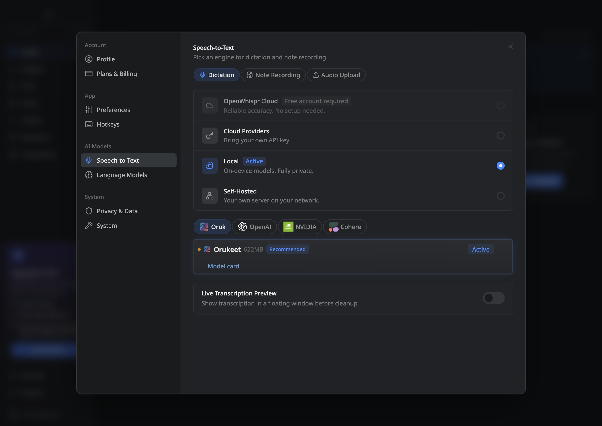

# OpenWhispr integration validation

The released r3 checkpoint runs through OpenWhispr's existing Parakeet TDT v3
sherpa-onnx path. This record covers the production application, public artifact,
and supported CPU platforms, checked on 10 September 2026.

## Artifact and application

- NeMo source SHA-256: `031c8ddab4845aeced904a7cde8e8aa57993b2e344716cf83a545b079c473b56`.
- Public ONNX artifact revision: `74673cf049c0c18f2572dab89f716b077461c2ea`.
- Archive SHA-256: `c4ad85bbfb0835167c097dedcec0bb3f50cc468edfe7e690442e2221427b95bf`.
- Archive: 486,664,389 bytes; extracted payload: 670,718,459 bytes.
- Application: [OpenWhispr PR #2085](https://github.com/OpenWhispr/openwhispr/pull/2085), including release v1.9.2 and upstream main `3b9e235c45012139a3fdb2fb3a36f429f1f6556b`.
- Inference: sherpa-onnx 1.13.4, ONNX Runtime 1.27.0, ordinary offline transducer loader and CPU provider.

The app registry pins the public artifact revision and checks download size.
The qualification harness additionally verifies the installed encoder, decoder,
joiner and tokens against the release SHA-256 manifest on each platform.

The [final application source record](app-final-source.json) pins the reviewed
commit and confirms that all four benchmarked inference/helper files remain
byte-identical after the Windows installation fix.

## Production recording flow

A fresh isolated profile runs the production main process, preload, renderer
and model worker. The test clicks through Local → Oruk → Orukeet, downloads
from the public Hugging Face URL without credentials, and records an English
WAV through Chromium's microphone fixture and the real MediaRecorder path.
Recognition and history persistence are not mocked.

The [recording receipt](app-gui-and-recording.json) verifies:

- Existing mode defaults remain intact; Orukeet appears as Recommended under Oruk.
- The current Oruk Signal logo loads in both the organization tab and model row.
- The Download button installs and selects the ONNX model.
- Mouse and keyboard activation open the model card through production IPC without changing selection.
- Two recordings produce the expected words and are saved in SQLite history.
- Cancelling an intervening recording saves no history entry; the next recording succeeds.

The [restart and shutdown receipt](app-production-shutdown.json) verifies a
subsequent production launch, real recognition through the preload IPC,
normal `app.quit()` teardown and termination of the registered model process.
The exact executed harnesses are retained as
[recording source](gui-and-recording-executed.cjs.txt) and
[shutdown source](production-shutdown-executed.cjs.txt).

## Platform qualification

Each job performs a real anonymous download through `ParakeetManager`, checks
all four model-file hashes, runs repeated and concurrent recognition, cancels
requests before and during recognition, then verifies recovery and restart.
These are functional checks; runner timings are not cross-machine benchmarks.

| Platform | Result | Receipt | Workflow |
| --- | --- | --- | --- |
| Windows x86-64 | Pass | [Receipt](app-ci-windows-x64.json) | [Windows job](https://github.com/Oruk-AI/openwhispr/actions/runs/34514441209) |
| Linux x86-64 | Pass | [Receipt](app-ci-linux-x64.json) | [Linux job](https://github.com/Oruk-AI/openwhispr/actions/runs/34511677066) |
| macOS Apple silicon | Pass | [Receipt](app-ci-macos-arm64.json) | [Apple silicon job](https://github.com/Oruk-AI/openwhispr/actions/runs/34511677066) |
| macOS Intel | Pass | [Receipt](app-ci-macos-x64.json) | [Intel job](https://github.com/Oruk-AI/openwhispr/actions/runs/34512306785) |

The [fixed Windows bootstrap](app-windows-extraction-fixed.json) succeeds with
the default PATH, followed by successful public model installation and every
recognition/lifecycle check.

[Fresh Windows testing](app-windows-extraction-baseline.json) reproduced a hang
in the built-in `tar.exe`: it spawned
an external `bzip2.exe` that did not complete. The integration now sends Windows
bzip2 model archives directly to the app's existing JavaScript fallback, and
uses the same bundled decompressor for the sherpa runtime bootstrap. Gzip/ZIP
extraction and non-Windows system-tar behavior remain unchanged. No dependency
or inference code is added. The separate fix passes 47 related regression tests
and the full quality check, including real and corrupt bzip2 fixtures.

macOS requires 15.5 or later, the same minimum as stock Parakeet's bundled
runtime. These checks cover the CPU targets shipped by OpenWhispr.

## Regression and recognition checks

The [application checks](app-quality-checks.json) record **4,056 passing tests**,
zero failures, six platform skips and one existing TODO, with database tests
required. Lint, formatting, TypeScript, locale validation, the production
renderer build and native-helper compilation pass. After merging the latest upstream
sign-in fix, 15 affected tests, quality checks, locale checks and the renderer
build also pass.

The [model-manager lifecycle receipt](app-lifecycle.json) covers both models:
process reuse, concurrency, silence, multilingual float-WAV normalization,
long-audio segmentation, cancellation and recovery. The [switching receipt](app-model-switch.json)
checks Orukeet → Parakeet → Orukeet in one manager.

The [paired application benchmark](../../integrations/openwhispr/APP_BENCHMARKS.md)
contains 640 English recordings, scored for both models through the same
production path. Pooled WER is **11.93% for Parakeet and 11.40% for Orukeet**;
median file-call time is **536 ms and 537 ms**, respectively. Every corpus score
and the reproduction protocol are published alongside the numeric counts.
