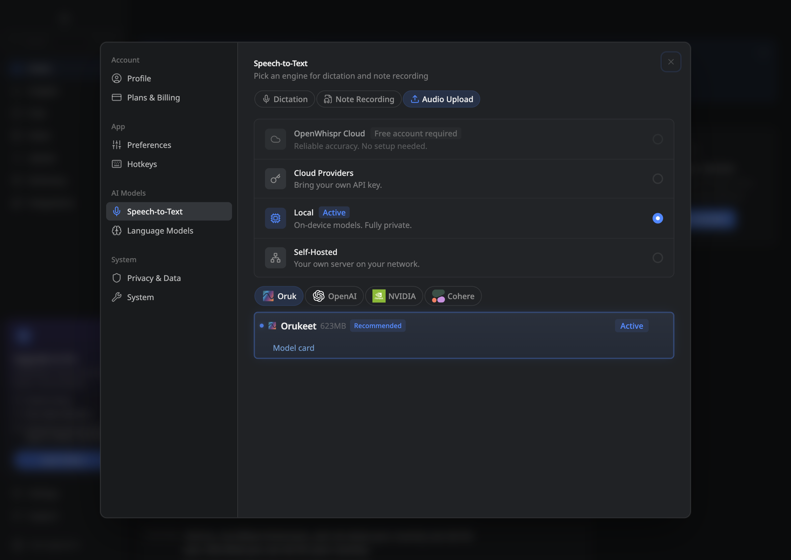

# OpenWhispr end-to-end validation

Production source: [`2516b0c03816fc8cd216becd3ccad249d3c63a7d`](https://github.com/Oruk-AI/openwhispr/commit/2516b0c03816fc8cd216becd3ccad249d3c63a7d), for [OpenWhispr PR #2085](https://github.com/OpenWhispr/openwhispr/pull/2085). The build includes upstream main `3b9e235c` and the latest published release at the time of testing, v1.9.2.

Orukeet uses the existing Parakeet TDT v3 sherpa-onnx runtime. All four installed inference files match the optimized public archive at Hugging Face revision `55a984d46f68323301837194ce647c702f55facc`. Neither model weights nor dependencies changed during this debugging pass.

## macOS

**17 checks pass across two application processes.** Six recordings exercise Orukeet, immediate consecutive recordings, cancellation and recovery, switching to stock Parakeet and back, and recording after restart. Visible live text comes from the current recording; final preview text, saved SQLite text and clipboard text agree. A unique clipboard sentinel prevents a previous recording from satisfying the delivery check.

English WAV, FLAC, an 88-second file and French float-WAV uploads pass. Each saved note contains the exact inference result and opens in the note editor. The long-file check verifies coverage across the repeated recording. Silence creates no note; cancellation aborts the backend call; the next upload succeeds. Model selection and every saved transcription and note survive a full process restart without reseeding preferences.

[Main receipt](macos.json) · [Restart receipt](macos-restart.json) · [Executed harness](macos-harness.cjs.txt) · [Installed model hashes](installed-model-verification.json)

## Windows

[The final Windows x64 run passes](https://github.com/Oruk-AI/openwhispr/actions/runs/34524247481) against the same production source. It downloads the public model through the actual picker and verifies the logo, Recommended state, model-card mouse/keyboard actions and all four inference-file hashes.

Five successful recordings span a fresh process and a restarted process. Both perform an immediate next recording while the previous final preview remains visible, then verify new live text, exact final text, SQLite history and fresh clipboard delivery. Cancellation and recovery pass. Saved choices and history survive restart without reseeding. Both complete process trees exit normally, with no remaining workers.

The existing Windows paste helper restores a captured scratch text field after focus moves elsewhere, inserts the decoded transcript through trusted native paste events, leaves the decoy field unchanged and restores the clipboard. No additional runtime dependency is used.

[Supervisor](windows/supervisor.json) · [Fresh process](windows/fresh.json) · [Restart and native paste](windows/restart.json) · [Executed harness](windows/orukeet-windows-e2e.cjs.txt)

## Bugs fixed during the test

- Silent local uploads now display “No speech detected in this audio.” Completed empty output carries the existing no-speech error code; broken or entirely truncated output remains a decoding error.
- Starting a new recording before the previous final preview disappears now updates the reused panel. The previous code cleared its readiness flag while keeping the panel open, preventing new text from being displayed. The actual-hook regression failed before the fix and passes afterward.

[Preview regression before](preview-hook-before-fix.txt) · [After](preview-hook-after-fix.txt) · [66 focused presentation tests](preview-hook-focused-tests.txt)

## Source checks

The final source passes **4,084 tests**, with zero failures, six skipped tests and one TODO. Database tests are required. Formatting, ESLint, TypeScript and the production renderer build pass. [Verification receipt](source-validation.json) · [Full-suite summary](full-suite-summary.txt).

## Test setup

The tests launch the production Electron renderer, preload and main process. A fixed WAV supplies microphone input through MediaRecorder; the file chooser selects controlled audio fixtures. Recognition, normalization, segmentation, SQLite persistence and clipboard delivery execute normally. The Mac profile comes from the earlier public model download test. Account and capture preferences are isolated test fixtures. Physical microphone hardware and global keyboard shortcuts are outside this automated test.

The timing fields are functional-test observations, not a comparative speed benchmark. [Paired accuracy and speed measurements](../../integrations/openwhispr/APP_BENCHMARKS.md) remain unchanged.

