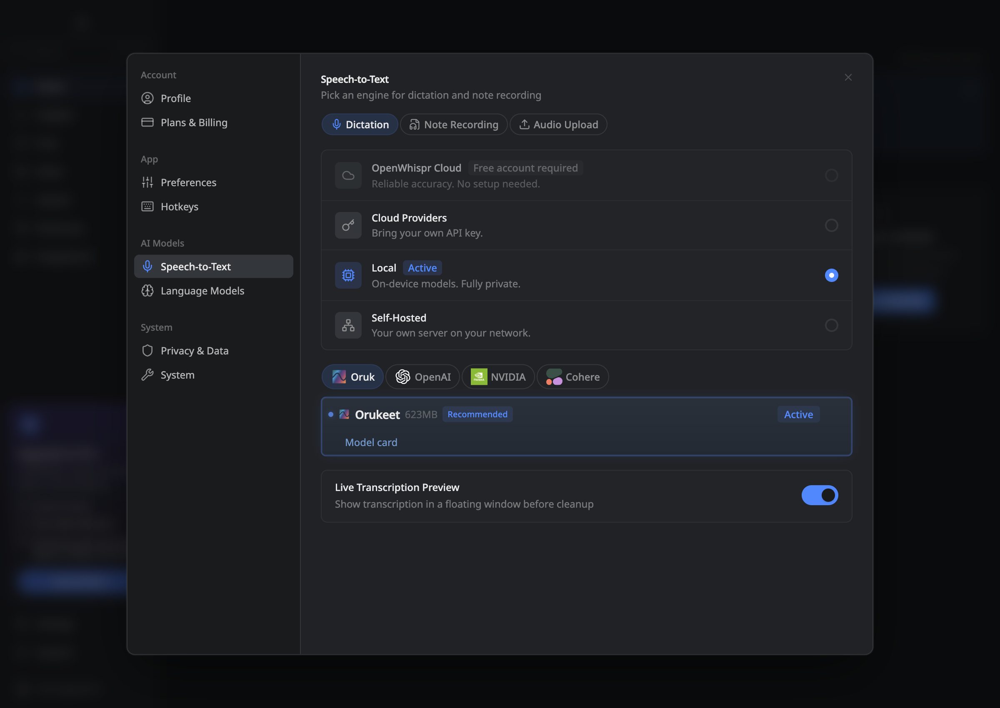

# Optimized Orukeet release checks

The OpenWhispr application changes are in commit
`f2d1fa16eda2ba54992941bb7a5a8aa137a826dc`, on top of upstream main
`3b9e235c45012139a3fdb2fb3a36f429f1f6556b` and the latest published release,
v1.9.2. The optimized model is pinned to Hugging Face revision
`55a984d46f68323301837194ce647c702f55facc`.

The package uses the same sherpa-onnx binary, CPU provider, dependencies and
thread selection as stock Parakeet. The encoder optimization changes execution
of 24 quantized depthwise convolutions. It preserves their values and outputs;
the decoder, joiner, tokens and released r3 checkpoint are unchanged.

## Accuracy and speed

- All 640 optimized Orukeet transcripts and statuses match the previous export.
  The two 160-clip control arms also match, giving 960 identical comparisons.
- Across the paired 160-clip timing subset, median file latency is 390 ms for
  optimized Orukeet, 432 ms for the previous export and 428 ms for stock Parakeet.
- Across all 640 clips, pooled WER remains 11.40% for Orukeet and 11.93% for
  stock Parakeet. Orukeet has lower WER in seven of ten corpora.
- Seventy-two isolated operator cases and four full-encoder cases have
  bit-identical outputs. Linux English, German, French, Spanish, silence and
  batch recognition also match.

[Application protocol and measurements](application-speed.md) ·
[Encoder arithmetic and measurements](README.md) ·
[All corpus scores](../../integrations/openwhispr/APP_BENCHMARKS.md)

The application benchmark records hashes of the executed source files. Its
runtime helpers are identical to the final commit; the final registry changes
only the pinned archive URL and sizes. Fresh installation below checks that
final registry and its optimized payload.

## Platform checks

All four jobs in [the optimized-model CI run](https://github.com/Oruk-AI/openwhispr/actions/runs/34519797164) pass: Windows x64, Linux x64, Intel Mac and Apple silicon Mac. Each downloads both immutable archives and uses the production runtime and thread selection. All 64 lifecycle checks and 16 transcript comparisons pass.

The three-repeat warm checks measure 1.5-, 3-, 6- and 11-second inputs. Fifteen of the 16 measured pairs are faster; the full Windows clip is effectively tied (1555.13 versus 1555.57 ms). [Every timing, hardware configuration and receipt](cross-platform-ci.md).

## Application checks

The full Node 24 test suite has **4,079 passing tests, zero failures, six skipped
tests and one TODO**, with database tests required. TypeScript, ESLint, Prettier,
locale keys/placeholders and the production renderer build pass. The registry
and changed-path regression tests pass again after the final download pin.

The production model manager passes 20 checks across Orukeet and stock Parakeet:
startup, repeated process reuse, concurrent calls, French/Spanish/Latvian input,
silence, empty input, cancellation before and during inference, recovery,
44-second segmentation, preview-sized prefixes, shutdown and restart.

A fresh-profile test uses the actual renderer and model picker to download the
public optimized archive anonymously. It checks all four inference-file hashes,
the Oruk logo, Recommended state, model-card link with mouse and keyboard,
selection persistence, live-preview recording, saved SQLite history,
cancellation and the next successful recording. A fixed WAV supplies microphone
input through MediaRecorder; recognition and persistence execute normally.
The test exits through normal application shutdown.

Six separate live-preview recordings compare the previous and new stop handler.
The new handler removes the redundant post-stop preview request while keeping
one full-audio final transcription and the same saved text. This change also
guards against a late preview result crossing into a newer recording session.

[Machine-readable local receipt](release-validation.json) ·
[Four-platform checks](cross-platform-ci.md) ·
[Archive readback](archive-readback.json)

