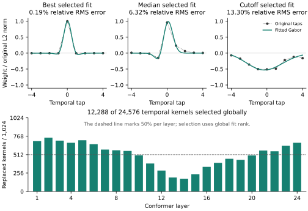
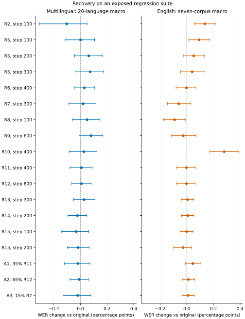

# Orukeet fitting and recovery

Orukeet **r3** contains 12,288 fitted, frozen temporal Gabor kernels. The FT-4035 parent follows R15-0100 recovery with 4,035 updates; the final r3 continuation adds 168 updates. Every current NeMo, Q8 and F16 download derives from r3. The [final continuation recipe](../librispeech_ft/README.md), [model card](../../MODEL_CARD.md) and [artifact catalog](../../src/orukeet/artifacts.json) describe the current model.

This guide gives the fit-and-freeze method and retains the chronological recovery experiments that produced R15-0100. Their checkpoint labels, accuracy comparisons and selection decisions belong to those experiments. The current [source and native audits](../../release/model-stages.json) identify r3 separately.

The method replaces the best-fitting half of Orukeet's temporal convolution
kernels and trains every parameter outside those replacements.
The eligible population is all 24 × 1,024 temporal depthwise kernels in the
Conformer encoder. Select 12,288 globally by fit quality, not 512 from each
layer. Pointwise channel mixing and the 2D subsampler are outside this temporal
kernel population and remain trainable.

## Fit and freeze

For the nine taps `t = -4, …, 4`, fit

```
g(t) = A exp(-0.5 ((t - μ) / σ)²) cos(2πf(t - μ) + φ).
```

Amplitude and phase are solved as signed cosine/sine coefficients for each
center, width, and frequency. The deterministic initializer searches 3,321
center/width/frequency combinations. Refine the best four starts and the best
start in each of four frequency bands with bounded nonlinear least squares.
Duplicate starts are removed. Retain the best objective, including the starting
point. The fit is to each exact original kernel in float64, without an additive
DC term or a learned residual in replaced rows. This is a multistart numerical
fit, not a proof of the global optimum.

Rank by `sum((w-g)²) / sum(w²)` so kernel magnitude does not determine selection.
Ties resolve by layer then channel. Record all fits, including unselected ones.
Amplitude and phase express the signed sine/cosine coefficients without a
redundant mixture parameter.

The fitted parameters and synthesized taps are buffers. A PyTorch
parametrization exposes only the unselected rows to the optimizer, preserving
channel order. AdamW cannot move the selected taps. Every other model parameter
is enabled, including the decoder, joint network, lower layers, and BatchNorm
scale/bias. The first run updated BatchNorm running statistics and regressed;
subsequent recovery runs preserve those buffers while training scale/bias. Export produces
ordinary dense Conv1d weights; the fit sidecar retains the analytic parameters.
Inference uses the original convolution shapes and compute; the fitted taps
are synthesized once before export.
The fitted frequency is measured per feature timestep after subsampling; it
is not a measurement of a speaker’s pitch. Nine-tap fits can have multiple
similar parameter settings, so the reconstructed taps are the constraint.

Tests cover the analytic fitting Jacobian, negative-phase fits, original channel
placement, AdamW with weight decay, serialization, and materialized exports.
Each training export records a hash and checks all frozen rows.

For the selected half, median relative kernel RMS error is 6.32%; the selection
cutoff is 13.30%. Their combined squared approximation error is 0.424% of the
selected kernels' original squared weight energy. These describe the weight
fits, not recognition accuracy. The exact fits and arrays are in [fits/](fits/).



See the [figure caption](results/gabor-fits-caption.md) for selection details.

## Reproduce the current comparison

From the repository root, run
`python evaluation/standard_asr/build_current_report.py --verify-pdf`
to recompute all 74 r3 paired split scores from the released integer counts. For a new fine-tune, restore the current NeMo source and install the
frozen-row parametrization before creating the optimizer, as shown in the
[training guide](../README.md). Recreating the original fits uses the
recorded adaptation baseline, whose hash appears below.

<details>
<summary>Chronological recovery experiments and recorded decisions</summary>

## Initial bounded run

- Start: the exact Orukeet source checkpoint SHA-256
  `313d615ca34c8ac3a183384e1f87e8274d748e5445af110013a335f02ae42e32`.
- Existing dedicated A100 40 GB; no new machine provisioning.
- Same pinned NeMo container as the original continuation; image identity is
  recorded with the experiment receipt.
- Existing audited multilingual/accent training mixture; no development audio
  enters training.
- 400 optimizer steps, AdamW, learning rate 2e-6 with 25-step warmup and cosine
  decay to 5e-7, 60 seconds per microbatch, accumulation 4, bf16 mixed precision.
- Export at steps 100, 200, 300, 400. This is recovery training, not a full epoch.
- TensorBoard and local scalar receipts, W&B disabled as in the prior run.

A deterministic 5,100-record development subset is frozen before candidate
inference: 100 recordings per existing source/language development manifest,
ordered by a fixed hash of their audio path. The primary endpoint equally
weights the CV and FLEURS language-macro WERs. Initial acceptance requires
primary WER no worse than the original, no source/language regression above
0.5 percentage points, and no accent-source regression above 1 point. This is
an exposed development regression, not a new holdout. A selected candidate must
also pass the larger existing release regression: primary and English macro
WER no worse than the original, each primary language within 0.5 points, and
each English corpus within 0.3 points. Limitations remain disclosed.
If the run misses these thresholds, retain the original and report the gap.

## Initial recovery results

All WERs below use the same 5,100 development recordings and decoding setup.
Lower is better. A lower overall WER alone does not pass the language guards.

| Checkpoint | Primary WER (%) | Development decision |
|---|---:|---|
| Original Orukeet | 10.08224 | Reference |
| Frozen Gabor replacement, before training | 10.01242 | Fail: four language slices |
| R1, 400 steps | 12.42073 | Fail |
| R1, 400 steps, original BatchNorm buffers restored | 10.08832 | Fail |
| R2, 100 steps | 10.03176 | Fail: four language slices |
| R2, 200 steps | 10.05010 | Fail: six language slices |
| R3, 100 steps | 10.15995 | Fail |
| R3, 200 steps | 10.19056 | Fail |
| R3, 300 steps | 10.19539 | Fail |
| R4, 100 steps | 10.09135 | Fail |
| R4, 200 steps | 10.11607 | Fail |
| R4, 400 steps | 10.07727 | Fail: seven language slices |
| R5, 100 steps | 10.05735 | Fail: six language slices |
| R5, 200 steps | 10.03734 | Fail: six language slices |
| R5, 300 steps | 10.06524 | Fail: six language slices |

The BatchNorm restoration diagnostic retains every learned R1 parameter and
replaces only 72 running-statistic buffers. It explains most of R1's overall
regression. SpeechOcean still regresses after that repair, so restoring buffers
alone is insufficient. R2 restarts from the original weights, preserves those
buffers, disables dropout, and uses a frozen copy of the original encoder as a
cosine-loss reference. Its learning rate is 2e-7, with 10-step warmup and cosine
decay to 5e-8 over 200 steps; the encoder-reference loss multiplier is 5.
All 651 non-Gabor parameter tensors received finite gradients in R2.

R3 is a separate recovery experiment selected after inspecting those development
results. It starts from the same original weights and fixed Gabor fits. It uses
length-masked encoder mean-square error divided by teacher signal energy,
averaged equally over utterances, plus 1e-5 times the original ASR loss. This
matches output magnitude as well as direction. Encoder learning rate is 1e-5;
decoder and joint network learning rates are 1e-8. All remain trainable. The
300-step run uses 10-step warmup and cosine decay to zero, keeps BatchNorm
buffers fixed, and disables dropout and SpecAugment. The reference encoder
never enters the student optimizer or exported checkpoint. R3 did not recover
ASR accuracy despite reducing the feature-matching training loss.

R4 tests prediction-level recovery. A frozen copy of the original encoder,
predictor, and joint network supplies token and duration distributions on
training audio. For each utterance and batch, 16 valid encoder timesteps and
16 valid teacher-forced prefix states are sampled with replacement. Student
and teacher use the same sampled states. The two TDT distributions are
normalized separately (8,193 token/blank classes and five duration classes).
The objective is 10 times their mean KL divergences plus 0.05 times the ASR
loss. This samples the conditional transducer lattice; it is not a full
sequence-level KL. The first forward must match NeMo's joint calculation
exactly, and tests check valid sampling, head partitioning, and gradients.
All remaining parameters train: encoder LR 1e-6, decoder/joint LR 2e-7,
10-step warmup and cosine decay to zero over 400 steps. BatchNorm buffers stay
fixed; dropout and SpecAugment are disabled. The 400-step export changed all
651 non-Gabor parameter tensors and preserved the frozen rows. Overall WER
matched the original, but seven language slices exceeded the development cap.
All three evaluated R4 checkpoints failed the development gate.

The recorded larger-test selection rule chose R2 at step 100, the lowest-WER
trained development candidate. On 23,038 recordings (53.67 hours), its
20-language macro WER improves from **15.37131% to 15.26822%**. Its English
seven-corpus macro worsens from **9.36033% to 9.49597%**. The paired English
delta interval is +0.05755 to +0.21442 points. SpeechOcean's official test set
accounts for most of that loss: 21.54142% to 22.36540% WER. The accented
VoxPopuli slice also regresses, from 20.99335% to 21.32718%. This candidate
does not meet the performance requirement. It is staged only for private
review in the existing private Hugging Face repository.

R5 continues from that audited R2 checkpoint. Its teacher still comes from the
original Orukeet source, and the same 12,288 Gabor rows stay fixed. Half the
top-level sampling weight retains the original mixture; the remainder is
20% English CV/FLEURS, 20% SpeechOcean training, and 10% English dialect
training. Dataset membership is unchanged. An explicit scan finds no training
path among the 28,138 development and larger-regression audio paths.
The upper six encoder layers use LR 2e-6; the lower encoder, subsampler,
predictor, and joint use LR 2e-7. All 651 parameter tensors remain in the
optimizer. The 300-step cosine schedule has a 10-step warmup and ends at zero.
The loss is the original ASR loss plus 0.2 times the token/duration distillation
losses. BatchNorm buffers remain fixed and dropout/SpecAugment remain disabled.
This is an adaptation prompted by exposed regression results, not an unseen
test of a fixed recipe. All three exported R5 checkpoints improve the overall
development mean, but each misses six language guards. On the larger suite,
R5 step 300 reduces the SpeechOcean regression to +0.20445 points, within the
per-corpus cap. However, primary WER is 15.44410% versus 15.37131%, and English
macro WER is 9.40085% versus 9.36033%. Both means still worsen, and accented
VoxPopuli exceeds its corpus limit. Step 200 also fails (15.43360% primary,
9.41144% English), as does step 100 (15.37205% primary, 9.45362% English).
All three larger-suite decisions are retained. None qualifies.



Bars show 95% paired cluster-bootstrap intervals; the dashed line is equal WER.
Lower is better. These intervals do not account for adaptive checkpoint
selection. The complete caption and source identities are beside the figure.

A further recovery objective is implemented in `layer_anchor.py`. It compares
the output of every Conformer block and every convolution branch with a frozen
copy of the original encoder on the same audio features. Each loss masks padded
frames, normalizes by reference signal energy per utterance, and averages over
the 24 layers. The original ASR objective remains active so the predictor and
joint network also receive gradients. The teacher is external to the student
optimizer and exports. This draws on layerwise ASR distillation; it does not
add layers or change the selected Gabor fits. Unit tests cover all layer hooks,
teacher isolation, matching inputs, and finite student gradients.
`results/layer-recovery-plan.json` records R6's starting-checkpoint rule,
objective, rates, and unchanged acceptance criteria before the remaining R5
larger-suite results. Because no R5 checkpoint passed, R6 starts again from
the original source with the same Gabor fits and original training mixture.
It uses 600 steps, encoder/subsampler LR 3e-6, predictor/joint LR 1e-7, ten-step
warmup and cosine decay to zero. Loss weights are 0.1 ASR, 5 block MSE, and
1 convolution-branch MSE. All 651 parameter tensors received finite gradients.
Exports and development evaluation are ordered 600, 400, 200. R6 completed all
600 steps and saved all three model exports. Development WER is 10.04672%,
10.00628%, and 10.00639% at steps 200/400/600. All fail language guards; the
recorded rule selects step 400 for diagnosis. Its larger primary WER is
15.40126% (+0.02996 points), while English is 9.35780% (−0.00253 points).
Every larger individual guard passes, but the primary mean and four development
guards still fail. The final optimizer snapshot was retired after completion;
all trained model exports remain. A live edit to the Bash launcher caused its
post-training handoff to exit with status 127. Evaluation was restarted from
the saved exports without retraining. Future dispatches snapshot and hash the
launcher before starting it. The incident receipt is retained with the results.

Starting with R6 evaluation, `evaluate_fast.py` calls the original evaluator
and replaces only its integer edit-distance function with RapidFuzz 3.14.3.
The normalizer, decoding, batches, and evaluation membership are unchanged.
Before enabling it, `validate_metrics.py` reproduced every stored word and
character error count for 51,176 original/candidate predictions and checked
1,000 generated Unicode cases against the old function. The wrapper requires
that audit and pins its source hash and library version. This removes a CPU
scoring bottleneck; it is not a model inference speedup.

The optimizer and first-backward audits fail if any remaining parameter is
missing or has a nonfinite gradient. Export independently checks the 12,288
frozen rows. Native Q8 export also checks that all selected rows equal the
fitted taps after FP32-to-F16 rounding, matching the pinned converter's storage
format. Native ASR still requires a separate measurement.

The R2 step-100 Q8 export completed a paired warm-latency check on the dedicated
A100: two warmups, 20 measured calls per model and fixture, with model order
reversed between two blocks. Candidate/original median ratios were 0.9665
(JFK), 1.0017 (French), 1.0039 (Spanish), and 1.0073 (Latvian). Decode and model
load time are outside those warm timings. This is a four-fixture measurement,
not a general speedup claim. CPU and Metal runs also completed on the shared
M5 Max, but unrelated compute work and large timing variation make those
comparisons provisional. Raw timings, hardware, model and runtime hashes,
and the host-contention caveat are retained. Gabor materialization leaves the
inference architecture and convolution operations unchanged.

Full per-slice decisions, failed attempts, source identities, and fit diagnostics
are retained in `results/`. No model has been promoted from this experiment.

## Source references

- [NVIDIA Parakeet v3 model card](https://huggingface.co/nvidia/parakeet-tdt-0.6b-v3)
  for the starting ASR architecture and inherited language scope.
- [LEAF](https://arxiv.org/abs/2101.08596) establishes a precedent for Gabor audio
  filters; its frontend results do not establish accuracy for this replacement.
- [SciPy least_squares](https://docs.scipy.org/doc/scipy/reference/generated/scipy.optimize.least_squares.html)
  documents the bounded numerical solver used here.
- [PyTorch parametrizations](https://docs.pytorch.org/tutorials/intermediate/parametrizations.html)
  documents constrained weight representation and materialization.
- [RapidFuzz Levenshtein distance](https://rapidfuzz.github.io/RapidFuzz/Usage/distance/Levenshtein.html)
  documents the unit-cost, unnormalized distance used by the verified scorer.
- [Accurate and Structured Pruning for Efficient Automatic Speech Recognition](https://arxiv.org/abs/2305.19549)
  uses distillation to recover a modified Conformer. It motivates a teacher
  reference here; its pruning results do not establish this Gabor experiment's
  accuracy, size reduction, or speed.
- [On the compression of shallow non-causal ASR models](https://arxiv.org/abs/2312.09842)
  uses KL distillation of model posteriors. R4 adapts that idea to sampled
  token and duration distributions in Orukeet's TDT head; it does not reproduce
  that paper's architecture or results.

The implementation preserves sign, globally ranked membership and original
channel order explicitly.

## Reproduction

Use a separate NeMo environment with NumPy, SciPy, PyTorch, and pytest. Run
`python -m pytest training/gabor_half/test_gabor.py training/gabor_half/test_compare.py -q`
there. `fit.py --source ORIGINAL.nemo --output FIT_DIRECTORY --workers 8`
creates all fitted parameters and the exact 50% selection; `audit_fit.py` checks
them. `export_initial.py` writes the replacement-only checkpoint. `train.py` and
`run_recovery.sh` implement recovery; `audit_checkpoint.py` independently checks
the on-disk weights. `compare.py` requires complete, matching development
predictions. `full_regression.py` runs the larger existing regression for a
development-qualified candidate. Its explicit `--diagnostic` option can also
measure an unsuccessful development candidate while retaining the failed
qualification; it cannot turn that failure into a pass. `export_native.py`
creates an isolated Q8 export that still needs its own accuracy check.
`native_development.py` runs matched native evaluations, and
`benchmark_native.py` records warm latency with the two model orders reversed.
`native_full.py` prepares a fresh paired larger replay after both source and
native development qualification. It stages only the 61 registered manifests;
the source directory also contains 14 unregistered slices. Runtime libraries,
bindings, audio code and evaluator hashes must match the native development
comparison. This harness is prepared; no current recovery candidate has reached
that native qualification stage.

`run_native_qualification.py --label LABEL` connects these steps for one
source-qualified export on the existing CUDA host. It records source and code
identities, stops at a failed native accuracy comparison, and measures paired
latency on the same four short English/French/Spanish/Latvian fixtures used in
R2, only after both native accuracy checks pass. It never changes
defaults. The exact manifest membership and Python 3.13/PyAV/librosa/runtime
imports passed preparation checks. An actual failed A2 source was rejected
before any native output directory or inference call was created. The controller
is ready; accepted-path accuracy and timing still require a qualifying model.

Export interval and optimizer-checkpoint retention are configurable; R6 exports
every 200 steps and retains one optimizer snapshot. A checkpoint-save delay in
R6 exposed a second multi-GB temporary copy across container filesystems. The
failed R5 run's optimizer state was retired while retaining its model exports
and evidence. Future processes set a per-run `TMPDIR` on the bind-mounted
filesystem; a transaction test verifies that temporary and destination files
share the same device. The change applies to subsequent launches; R6 completed with the original process settings.

To resume after interruption, use a fresh output name and pass
`++resume_checkpoint=/absolute/path/to/resume-STEP.ckpt` with the original
training horizon and fit file. The original source and fitted rows must match.

## Reproduce the surgery statistics without private speech

The [R6 count bundle](results/metric-r6-0400.tar.gz) contains both 5,100-clip
development and 23,038-clip larger-suite reference/candidate counts. It omits
audio, transcript text and speaker names. Reference/path fingerprints and
pseudonymous cluster ranks preserve pairing and bootstrap order; they are not
a formal anonymization guarantee.

```sh
mkdir -p artifacts/gabor-metrics
tar -xzf training/gabor_half/results/metric-r6-0400.tar.gz -C artifacts/gabor-metrics
OPENBLAS_NUM_THREADS=2 python training/gabor_half/reproduce_metric_evidence.py \
  artifacts/gabor-metrics/metric-r6-0400 --output reproduction.json
```

Requires NumPy; no model download, torch or GPU. The local reproduction receipt
records exact equality for all comparison fields. The committed comparator is
byte-identical to the historical VM comparator (SHA-256 `347d8fef42c3409dd2d8fdd2dc3e82ffe167b7ab7f1624cef2a80bc46308c3a4`).
Future remote runs stage that committed module explicitly. The primary endpoint
uses 13,246 recordings and 46 slices within the larger suite.

R7 continued R6-0400 for 300 steps with the same fixed fits. Its existing-data
mixture assigns 40% to the original pool, 40% equally to Bulgarian, Estonian,
Hungarian and Ukrainian, 12% to English CV/FLEURS and 8% to the English accent
extension. All training membership is retained; exact evaluation-path overlap
is zero. See the audited input and start-decision receipts for the full recipe.
Every requested export is evaluated before selecting the lowest development
WER among passing exports, or the lowest for diagnosis when none passes.

## R7 result and R8 continuation

R7 completed 300 steps. All three exports preserve the same 12,288 fitted rows and optimizer coverage of all remaining parameters. Its minimum-development-WER export, step 300, scores **9.969561%** versus **10.082235%** originally. Common Voice Bulgarian (+0.874317 pp) and Latvian (+0.626566 pp) still exceed the +0.5 pp guards.

The larger matched comparison scores **15.391870%** versus **15.371307%** multilingual WER and **9.299936%** versus **9.360330%** English macro WER. Every individual larger guard passes; the multilingual mean and development failures still prevent qualification. No defaults changed. Results: `results/comparison-r7-0300.json`, `results/full-r7-0300.json`, and the three audit/coverage receipts.

R8 continued from that audited export for 400 steps. The existing training pool remains unchanged, with 40% original mixture, 40% split equally between Bulgarian/Latvian, 12% English CV/FLEURS and 8% English accent extensions. Exact path checks cover all 28,138 evaluation records without overlap. This is an outcome-informed curriculum, not new confirmation data. The objective is TDT ASR + 5 block-anchor + 1 conv-anchor loss; upper encoder LR is 2e-6, lower/subsampler LR 1e-6, decoder/joint LR 1e-7. All replacement functions remain frozen. All four exports received the same development checks before one diagnostic larger comparison.

The failed R3 trained weights were archived and verified at an immutable private model-repository revision before their redundant VM copies were removed. R7's completed optimizer snapshot was retired; its three NeMo exports remain. R8 starts a fresh optimizer from the exact R7 weights.

## R8 result and broader R9 continuation

| R8 step | Development WER (%) | Failed language guards |
|---|---:|---|
| 100 | 9.975037 | CV Bulgarian/Latvian; FLEURS Finnish |
| 200 | 9.992699 | CV Czech/Italian/Latvian; FLEURS Finnish/Hungarian/Latvian |
| 300 | 9.982095 | FLEURS Finnish/Hungarian/Latvian |
| 400 | 9.992489 | CV Latvian/Portuguese; FLEURS Latvian |

Every export passes the independent exact-kernel audit, changes all 651 parameter
tensors from the original and preserves BatchNorm running statistics. The gradient
receipt covers all remaining trainable tensors. Step 100 has the lowest development
WER and is selected for diagnosis under the existing rule.

Its [larger comparison](results/full-r8-0100.json) scores **15.421902%** multilingual
against **15.371307%** originally, a +0.050595 percentage-point change (paired 95%
interval −0.059801 to +0.145341). English improves from **9.360330% to 9.268413%**,
−0.091918 points (−0.173633 to −0.010997). The multilingual mean and Danish guard
fail; development also fails. This is not a qualified replacement.

R9 continues R8-0100 for 600 optimizer steps with exports at 200/400/600. The
objective, learning-rate groups, fixed BatchNorm statistics and Gabor functions
remain as in R8. Warmup is 25 steps; cosine decay ends at zero. Seed 20260907
changes minibatch order. The curriculum now assigns 60% to the full original
mixture, 20% equally to CV Bulgarian, CV Latvian and FLEURS Finnish, 10% to English
CV/FLEURS and 10% to accent extensions. All existing training manifests remain,
and all 28,138 evaluation paths are excluded. Two unit tests check exact
source/language targeting, preserved membership and rejection of an unjustified
curriculum. The same evaluation and selection rules apply.

Six audited failed R4/R5 exports were preserved at a verified immutable private HF
revision. Only their redundant VM copies and the completed R8 optimizer may be
retired to make room; all R8 NeMo exports remain. R9 uses a fresh optimizer.

## R9 result and convolution-focused R10 recovery

| R9 step | Development WER (%) | Failed language guards |
|---|---:|---|
| 200 | 9.975218 | CV Bulgarian/Hungarian |
| 400 | 9.990009 | CV Czech/Latvian; FLEURS Slovenian |
| 600 | 9.951292 | CV Italian |

The three independent checkpoint audits verify all 12,288 fixed rows exactly,
finite tensors, unchanged tokenizer assets and changes to all 651 remaining
parameter tensors. The final export has the lowest development WER, against
10.082235% originally. Its Italian increase is +0.610998 percentage points,
above the unchanged +0.5-point guard.

The [larger R9 comparison](results/full-r9-0600.json) scores **15.451277%**
multilingual WER versus **15.371307%**, a +0.079971-point change (paired 95%
interval −0.010829 to +0.167714). English scores **9.334745%** versus
**9.360330%**, −0.025585 points (−0.114572 to +0.068489). All individual larger
guards pass; the multilingual mean and development failure prevent qualification.

R10 starts from R9-0600 for 400 steps, exporting at 200 and 400. It restores the
complete original sampling mixture. A dedicated learning-rate group covers the
120 trainable convolution tensors: the pointwise projections, free depthwise
rows and BatchNorm affine terms. Their rate is 2e-5; the other 531 tensors retain
the prior positive rates (upper encoder 2e-6, lower encoder/subsampler 1e-6,
decoder/joint 1e-7). The objective is ASR + 5 block-anchor + 5 conv-anchor loss,
with the exact original teacher and seed 20260908. Every Gabor function and
BatchNorm running-statistic buffer stays fixed. The two optimizer-group tests
exercise all 651 actual parameter names and reject frozen, duplicate, missing
or invalid-rate membership. Runtime gradient and on-disk audits still apply.

This is a compensation hypothesis, not a measured improvement. Both declared
exports receive the unchanged checks. The obsolete R9 optimizer snapshot is
retired only after training/evaluation completion and hash verification of all
three retained NeMo exports; R10 deliberately uses a fresh optimizer.

## R10 result and stronger teacher supervision

R10 completed 400 steps. The two independent export audits preserve all fitted
rows exactly, all 651 remaining tensors received finite gradients, and BatchNorm
running statistics remain fixed. Development WER is 9.926800% at step 200 and
9.926624% at step 400, against 10.082235% originally. Step 200 misses seven
language guards; step 400 misses those seven and the SpeechOcean accent guard.
The smallest development mean selects step 400 for diagnosis only.

Its [larger result](results/full-r10-0400.json) is **15.396722%** multilingual
WER versus **15.371307%**, +0.025415 points (paired 95% interval −0.084796 to
+0.124389). English scores **9.641385%** versus **9.360330%**, +0.281055 points
(+0.171853 to +0.390081). Both means, Danish and the English learner guard fail.
R10 is unqualified. A lower development mean did not preserve larger-suite
English accuracy.

R11 repeats R10 from the same R9-0600 initial checkpoint, with the same original
training mixture, seed, learning-rate groups, 400-step horizon and 200/400
exports. Only the objective coefficients change: **0.1 ASR + 50 block-reference
+ 25 convolution-reference**. This tests stronger preservation of the original
encoder's behavior. Every remaining parameter still trains; the teacher stays
outside the optimizer, and fitted kernels and BatchNorm statistics remain fixed.
The same audits, selection rule and accuracy gates apply.

`average_recovered.py` is a separate prepared comparison, with ten CPU unit tests
covering exact fixed-row preservation, buffers, parameter interpolation and
rejection of incompatible states. Averaged candidates receive their own audits
and recognition evaluations; they cannot inherit a parent's accuracy.

## R11 result and declared A1 averages

R11 completed 400 steps with both independent kernel audits passing. Development
WER is 10.029579% at step 200 (Hungarian on both sources and FLEURS Ukrainian
miss guards), and 10.011194% at step 400. Step 400 misses only FLEURS Finnish:
+0.543109 points against a +0.5-point limit, one excess error beyond the allowed
integer count on 1,473 reference words. The original development mean is 10.082235%.

The selected step-400 [larger comparison](results/full-r11-0400.json) scores
**15.379119%** multilingual WER versus **15.371307%**, +0.007812 points (paired
95% interval −0.078960 to +0.088399). English scores **9.356939%** versus
**9.360330%**, −0.003392 points (−0.077291 to +0.064543). Every larger individual
guard passes. The primary mean and Finnish development failure still prevent
qualification; neither threshold is relaxed.

A1 tests three averages of the trained R2-0100, R7-0300 and R11-0400 states.
The first two parents have complementary larger multilingual/English results;
R11 repairs their Bulgarian/Latvian development failures. These observations
come from exposed regressions, and WER is not assumed to interpolate linearly.

| A1 candidate | R2 weight | R7 weight | R11 weight |
|---|---:|---:|---:|
| a1-0350 | 0.1625 | 0.4875 | 0.35 |
| a1-0500 | 0.125 | 0.375 | 0.50 |
| a1-0650 | 0.0875 | 0.2625 | 0.65 |

Each parameter uses one ordered float64 weighted sum and one cast to its
original storage dtype. All 12,288 fitted rows, other buffers and the exporting
parent's module metadata are preserved exactly. Common module versions must
match. One known stateless training-augmentation metadata entry may be absent
from other parents only when it owns no stored tensor. This preflight difference
stopped the first attempt before any model or evaluation was produced; the
failure and narrow compatibility fix are recorded. Tokenizer assets and inference
configuration must match. There are no additional optimizer steps and each result is one
ordinary dense checkpoint.

All three candidates receive development checks. Development-passing candidates
receive the larger comparison in increasing development-WER order, stopping at
the first full pass; any unrun larger comparison is named explicitly. If none
passes development, only the lowest-WER candidate receives a diagnostic larger
comparison. Every executed result is retained. Native validation remains a
separate requirement, and canonical defaults remain pre-surgery.

All three A1 development evaluations are complete:

| Candidate | Development WER | Failed guards |
|---|---:|---|
| a1-0350 | 9.954121% | FLEURS Finnish +0.543109 pp; Latvian +0.544794 pp |
| a1-0500 | 10.037853% | Common Voice Bulgarian +0.546448 pp; FLEURS Finnish +0.543109 pp; Hungarian +0.776484 pp |
| a1-0650 | 10.013468% | FLEURS Hungarian +0.887410 pp; Latvian +0.544794 pp |

The original mean is 10.082235%. Each average improves that mean, but none
passes all language guards. All three independent audits preserve exactly
12,288 fitted rows and find changes in all 651 parameter tensors. Under the
declared rule, a1-0350 receives the sole diagnostic larger comparison. There is
no qualifying A1 candidate.

The completed [larger comparison](results/full-a1-0350.json) scores 15.352255%
multilingual WER versus 15.371307%, a −0.019052-point change (paired 95% interval
−0.121223 to +0.070656). English scores 9.406349% versus 9.360330%, +0.046018
points (−0.010678 to +0.105994). All individual larger guards pass; the English
mean fails. The other two larger comparisons were not run, as recorded in
`results/a1-selection.json`. All three averaged weights are archived privately.

## R12 continuation

`run_teacher_continuation_r12.py` can start only after A1's declared comparisons
finish without a qualifying candidate. It continues R11-0400 for 800 steps with
the same original training mixture, objective coefficients and per-group peak
learning rates. The optimizer and cosine schedule start fresh; sampling uses
seed 20260909. Both step-400 and step-800 exports must be audited and evaluated
under the unchanged selection rule. Every remaining parameter trains; the fitted
rows and BatchNorm statistics stay fixed. This tests whether more optimization
helps the near-baseline R11 result. R10's two model copies were retired only after immutable private
archive verification. R11's completed optimizer state was retired after retaining
and verifying both exported models. All A1 weights and parent models remain
available, and no training or evaluation data was removed.

R12 completed all 800 steps; all 81 logged metric records are finite. Both
independent export audits find exactly 12,288 fixed rows, changes in all 651
parameter tensors, matching tokenizer assets and finite weights. Development
WER is 10.026511% at step 400 and 10.010372% at step 800, versus 10.082235%.
Both miss only FLEURS Latvian: +0.544794 points, one excess word error beyond
the +0.5-point guard on 1,652 reference words.

The selected step-800 [larger comparison](results/full-r12-0800.json) scores
**15.379236%** multilingual WER versus **15.371307%**, +0.007930 points (paired
95% interval −0.064656 to +0.079481). English scores **9.357365%** versus
**9.360330%**, −0.002965 points (−0.076797 to +0.062379). English and every
individual larger guard pass. The primary mean and development failure still
prevent qualification.

## A2: averages within the teacher-recovery lineage

A2 tests the two closely related R11-0400 and R12-0800 checkpoints. R11 misses
the Finnish development guard; R12 misses Latvian. Both remain about 0.008
points above the larger multilingual baseline. These are exposed outcomes;
averaging is a recovery hypothesis, not a way to infer unmeasured accuracy.

| Candidate | R11 weight | R12 weight |
|---|---:|---:|
| a2-0350 | 0.65 | 0.35 |
| a2-0500 | 0.50 | 0.50 |
| a2-0650 | 0.35 | 0.65 |

The generator preserves all fitted rows and other buffers, averaging the
trained parameters in float64 with one final cast. The Gabor fraction stays
50%; each result is a single dense model. There are no new optimizer steps.
All three candidates receive development checks, followed by the same A1
larger-comparison order and stopping rule. Parent identities, comparison hashes
and weights are declared before scoring. A1's three VM model copies were
retired only after verifying their immutable private archive; all R11/R12
exports and the R12 optimizer checkpoint remain available. Native accuracy and
latency remain separate requirements before any default changes.

All three development evaluations and independent structural audits are complete:

| Candidate | Development WER | Failed guards |
|---|---:|---|
| a2-0350 | 10.050867% | Common Voice Hungarian +0.544959 pp |
| a2-0500 | 10.008086% | FLEURS Lithuanian +0.500939 pp |
| a2-0650 | 10.020236% | None |

The original mean is 10.082235%. The 65% R12 average is the only development
pass and proceeds to the declared larger comparison. Its source SHA-256 is
`44059de88f9797dcd9a3386e1b267733937326c518b2d570468911b6f7da18db`.
Each audit finds exactly 12,288 fixed rows, all 651 remaining parameter tensors
changed, finite weights and matching tokenizer assets. A development pass
does not establish source or native qualification.

The completed [larger comparison](results/full-a2-0650.json) scores **15.360944%**
multilingual WER versus **15.371307%**, −0.010362 points (paired 95% interval
−0.078866 to +0.060139). English scores **9.372779%** versus **9.360330%**,
+0.012449 points (−0.033806 to +0.058567). Every individual larger guard passes;
the English mean alone prevents source qualification. Neither other average
receives a larger comparison, as recorded in `results/a2-selection.json`.

## R13: short English recovery from the development pass

`run_english_recovery_r13.py` starts from a2-0650 only after all declared A2
comparisons finish without qualification. It uses 300 steps, exports at 100,
200 and 300, sampling seed 20260910, a fresh cosine schedule and 10 warmup
steps. Every per-group peak learning rate is half R12's. The objective remains
0.1 ASR + 50 block + 25 convolution-branch matching to the original teacher.

Sampling uses 80% of the original mixture plus 20% of its original English
Common Voice/FLEURS group. The total English sampling share rises from about
19.5% to 35.6%, including the accent extension. All 1,716,650 training rows
remain available, and all manifest hashes match R12. The data audit again
excludes all 28,138 evaluation paths. Path exclusion does not establish acoustic
or speaker independence. All 651 remaining parameter tensors train; the exact
12,288 Gabor rows and BatchNorm running statistics stay fixed.

All three exports receive development checks. Development passes are tested
on the larger suite in increasing development-WER order, stopping at the first
full pass. If none passes development, only the lowest mean receives a
diagnostic comparison. Every result and any unrun larger comparison are retained.
All original gates and separate native requirements remain in force. The two
R12 VM exports were retired after immutable private archive verification; their
completed optimizer was retired because R13 starts a fresh one. All three A2
exports and all R11 exports remain on the VM. No data was removed.

The first R13 gradient audit confirms finite gradients for all 651 parameter
tensors and verifies the actual training source hashes, start model, unchanged
teacher objective, half learning rates, sampling mixture, seed and schedule.
All 300 optimization steps and the three declared model exports are complete;
each export verifies all 12,288 fitted rows. All 31 logged scalar records are
finite. Independent checkpoint audits and accuracy evaluations follow the
training process's final checkpoint save.

All three independent audits pass, preserving the exact fixed rows and finding
changes in all 651 remaining parameter tensors:

| Checkpoint | Development WER | Failed guards |
|---|---:|---|
| Step 100 | 10.012671% | Common Voice Hungarian +0.681199 pp; Slovenian +0.704225 pp |
| Step 200 | 10.033607% | Common Voice Hungarian +0.544959 pp |
| Step 300 | 10.009554% | None |

Step 300 is the only development pass and enters the declared larger comparison.
Its source SHA-256 is `9607ae4b03331b575947f98f20e369affc9ee7d097058f04581bcfcd3a6378c2`.
The [larger comparison](results/full-r13-0300.json) scores **15.399187%**
multilingual WER versus **15.371307%**, +0.027881 points (paired 95% interval
−0.050749 to +0.109222). English scores **9.366059%** versus **9.360330%**,
+0.005728 points (−0.040930 to +0.051929). Every individual larger guard passes,
but both macro means fail. The other two larger comparisons were not run.
All three R13 models are preserved in a verified private archive.

## R14: one teacher for hidden states and TDT decisions

`LayerAnchor` now optionally matches sampled token and duration posteriors
using the same original encoder teacher forward as its block and branch
losses. A separate frozen decoder/joint copy supplies the teacher posteriors.
The student receives one ASR term. The two TDT distributions normalize
separately over 8,193 token classes and five duration classes. This reuses the
sampled-state KL calculation from R4; it is not a full-sum or aligned-path
distillation implementation.

Four CPU tests in the pinned NeMo container verify the objective, one encoder
and decoder teacher pass, student gradients, teacher exclusion from student
parameters/state, padding exclusion and separate token/duration normalization.
The default layer-only path retains its objective and sampling-RNG behavior.
Actual NeMo joint parity and complete gradient coverage are checked during
training before its output can be used.

`run_shared_teacher_r14.py` returns to A2-0650 and the original training mixture.
It declares 400 steps, exports at 200 and 400, seed 20260911 and ten warmup
steps. It uses R13's encoder rates and R12's decoder/joint rates. The objective
is 0.1 ASR + 50 block + 25 branch + 1 token KL + 1 duration KL. Every remaining
parameter trains; Gabor functions and BatchNorm running statistics stay fixed.
All original data hashes were rechecked against the path-overlap audit.

Both exports are audited and evaluated. Development passes receive the larger
comparison in increasing development-WER order, stopping at the first full
pass; otherwise only the lowest development mean is measured diagnostically.
Every result and any unrun comparison remain recorded. Native qualification
is separate. To provide disk space, R13's completed optimizer and its archived
step-100/200 copies were retired; R13-300 and all A2/R11 exports remain on the VM.

Training completed all 400 steps with 41 finite metric records. Both exports
pass independent audits: exactly 12,288 fixed rows, finite tensors, unchanged
tokenizer assets and changes in all 651 remaining parameter tensors.

| Export | Development WER | Decision |
| --- | ---: | --- |
| R14-0200 | 10.070953% | Pass all development checks |
| R14-0400 | 10.047487% | Fail CV Slovenian and FLEURS Lithuanian/Latvian guards |

Only step 200 enters the declared larger comparison. Its
[audited ancestry](results/r14-0200-ancestry.json) includes R6-400, R7-300,
R8-100, R9-600, R11-400, R12-800, the A2 average and 200 R14 updates. The
longest path contains **2,800 recovery updates**, with optimizer restarts and
parameter averaging. It excludes pre-surgery training and other trial branches;
describing this candidate as only a 200-step fine-tune would omit its ancestry.
The [larger result](results/full-r14-0200.json) improves multilingual WER to
**15.348847%** versus **15.371307%**, −0.022459 points (paired 95% interval
−0.093538 to +0.046888). English is **9.367143%** versus **9.360330%**,
+0.006812 points (−0.038972 to +0.053362). All individual larger guards pass,
but the English mean fails. Step 400 receives no larger comparison. Both R14
exports are preserved in the verified private archive; neither is a default.

## A3: conservative averages with an earlier English-strong recovery

`run_average_recovery_a3.py` declares three averages of R14-200 and R7-300,
using R7 shares of 15%, 25% and 35%. R7 has a lower English mean but a higher
multilingual mean than the original. These complementary endpoint results
motivate an experiment; weight interpolation does not imply interpolated WER.
The same tested averaging helper copies all fixed Gabor rows and non-parameter
buffers exactly and averages the 651 trained parameter tensors once in float64.
There is no new optimizer run or inference ensemble. All three receive audits
and development evaluation before the unchanged larger-test selection rule.

All three exports pass the independent structural audit, including unchanged
Gabor rows, tokenizer assets and buffers, with all 651 parameter tensors changed
from the original. Development results are:

| R7 share | Development WER | Failed guards |
| --- | ---: | --- |
| 15% | 10.006254% | CV Bulgarian |
| 25% | 10.025022% | FLEURS Latvian |
| 35% | 10.060714% | CV Hungarian and Slovenian |

None passes development. The lowest-WER 15% variant receives the one declared
larger diagnostic; it cannot qualify regardless of that comparison's means.

That [diagnostic](results/full-a3-0150.json) scores **15.351118%** multilingual
WER, −0.020189 points versus the original (paired 95% interval −0.131258 to
+0.078871). English is **9.371242%**, +0.010911 points (−0.034682 to +0.056466),
so its larger English mean also fails. All larger individual guards pass.
The 25% and 35% variants receive no larger comparison. All three model files
are preserved in a verified private archive.

## R15: English sampling with the shared teacher

`run_shared_english_r15.py` returns to R14-200 and reuses R13's audited mixture:
80% original multilingual/accent sampling plus 20% original English CV/FLEURS.
Every training member remains. R14's largest positive English-corpus delta is
Common Voice; A3 did not recover the overall English mean.

R15 declares 200 steps, exports at 100/200, seed 20260912 and a fresh cosine
schedule with ten warmup steps. Encoder/conv rates are half R14's: lower
encoder and subsampler 2.5e-7, upper encoder 5e-7, conv modules 5e-6. Decoder
and joint rates stay at 1e-7. The shared-teacher objective stays 0.1 ASR + 50
block + 25 branch + 1 token KL + 1 duration KL. All 651 remaining parameter
tensors train; the 12,288 Gabor rows and BN statistics stay fixed. Both exports
receive the original audits and accuracy gates. Before launch, five verified
archive copies were retired from the VM: all A3 exports, R14-400 and R13-300.
The R14-200 parent and all data remain available locally.

R15 completed all 200 steps with 21 finite metric records. Actual NeMo joint
parity, optimizer coverage and all 651 gradients pass; the recorded source,
sampling mixture and rates match the declaration. Both independent export
audits preserve all 12,288 Gabor rows exactly and verify changes in every
remaining parameter tensor.

| Export | Development WER | Decision |
| --- | ---: | --- |
| R15-0100 | 10.011620% | Pass every development guard |
| R15-0200 | 10.028141% | Pass every development guard |

Step 100 **passes all source accuracy gates** on the larger suite:
multilingual WER is **15.340887% versus 15.371307%**, and English macro is
**9.359238% versus 9.360330%**. Every individual language/corpus guard passes.
The paired 95% intervals for the changes are [−0.141035, +0.061823] and
[−0.049291, +0.047073] percentage points; neither establishes a significant gain.
Step 200 receives no larger comparison under the declared stop-at-first-pass rule.
[Full result](results/full-r15-0100.json) · [Selection](results/r15-full-selection.json).

The [step-100 ancestry](results/r15-0100-ancestry.json) has a longest recovery
path of 2,900 updates, including earlier runs and parameter averaging. The
[R15 count bundle](results/metric-r15-0100.tar.gz) and
[local reproduction](results/metric-r15-0100-local-reproduction.json) reproduce
every development and larger statistic exactly, without acoustic inference.
The native Q8 export preserves all 12,288 fixed rows after F16 rounding.
Separate native checks fail for both Q8 and F16; defaults stay on the
pre-surgery model. The detailed decisions follow.


### R15 Q8 deployment result and F16 check

The [paired native development result](results/native-r15-0100-development.json)
improves the mean to 10.053410% versus 10.101759%, but fails three 0.5 pp
language guards: Common Voice Latvian +0.501253 pp, Ukrainian +0.554017 pp,
and FLEURS Lithuanian +0.500939 pp. Each is one word error beyond its allowed
count. The larger native comparison and latency were not run. The source pass
remains valid; the Q8 export is not deployment-qualified.

The [next declaration](results/r15-native-f16-start-decision.json) tests the
same audited source checkpoint with the same converter at F16 precision.
No training, fitted kernels, native decoder or acceptance gates change. The
reference remains the original pre-surgery Q8. Higher precision costs size and
possibly latency; it must pass accuracy and receive separate speed measurements.

F16 passes every native development gate at 10.021133% versus 10.101759%.
Its [larger native result](results/native-r15-0100-f16-full.json) fails:
multilingual WER is 15.371980% versus 15.303734%, English is 9.360357% versus
9.323968%, and Lithuanian exceeds its 0.5 pp language cap. The latency stage
does not run after this failure. Both Q8 and F16 pass Mac/Metal, Windows and
Linux fixture/lifecycle checks; F16 also passes the real Electron backend.
Those compatibility results do not override the accuracy failures.

The [separate fallback declaration](results/r15-0200-native-fallback-decision.json)
evaluates the already-trained step-200 source checkpoint once after these native
failures. It adds no training and preserves the original R15 selection record,
which stopped at the first source pass. If step 200 fails source accuracy, this
fallback stops; a source pass permits separate native Q8 qualification.

The step-200 fallback [passes every source gate](results/full-r15-0200.json):
15.354356% multilingual WER versus 15.371307%, and 9.333105% English versus
9.360330%. Its longest recovery ancestry is 3,000 updates. Its Q8 export lowers
native development WER to 10.076550% versus 10.101759%, but fails the Russian
Common Voice guard (+0.580720 pp, cap +0.5). Larger native evaluation and latency
do not run for that export. No fitted kernels, training steps or thresholds change.


## One mixed-precision native export

R15-0200 already passes every source gate; this export adds no training.
`transducer_f16.py` changes storage for seven predictor/LSTM and joint matrices
from Q8 to F16 directly from the same source checkpoint. It audits all 694
other tensor payloads and types byte for byte against the R15-0200 Q8 export.
Every one of the 12,288 fitted Gabor rows remains exact after the declared
FP64 → FP32 → F16 rounding path. The model is 726,517,920 bytes, an increase
of 12,061,216 bytes over its Q8 baseline.

The [declaration](results/native-r15-0200-t16-start-decision.json) fixes the
single precision variant and unchanged evaluation/decoding settings. Its
[lineage](results/native-r15-0200-t16-lineage.json) records the seven changed
matrices and the exact source. The [native development result](results/native-r15-0200-t16-development.json)
passes all gates: 10.0678555% versus 10.1017591% WER. Original predictions are
reused only after checking runtime, decoder, audio code, membership and every
prediction-file hash; candidate inference is fresh.

The [larger native comparison](results/native-r15-0200-t16-full.json) fails:
multilingual WER is 15.376543% versus 15.303734%, and Lithuanian exceeds its
guard. English improves to 9.304915% versus 9.323968%. Latency was not run.
Functional fixtures pass on Windows
CPU (17 checks), Linux CPU (17) and Mac Metal (18); the actual Electron backend
passes six lifecycle checks. Those results do not substitute for aggregate
accuracy or a paired speed comparison. This experiment did not change the
canonical model at the time.

</details>
